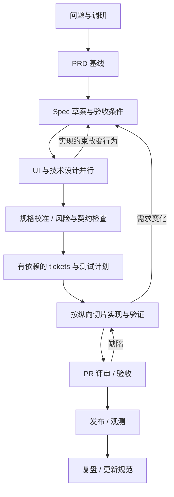

# 从问题到实施的交付链路

统一术语：PRD 回答“为什么、为谁、做到什么”；spec 回答“系统应表现为何”；技术设计回答“如何实现”；tickets 回答“谁以什么顺序完成哪些可验收工作”。用户提出的第二次 `to spec` 在这里明确为**设计后的规格校准与一致性检查**，避免产生两份互相冲突的规格。

## 时间与依赖

这是一条依赖链，允许短循环。界面探索、性能 spike 可提前并行，但明确为探索且记录结论，不把未验收原型视为交付。阶段完成取决于退出条件，不取决于经过几天。

## 阶段与质量门槛

| 阶段 | 输入 → 产物 | 退出条件 | 主要责任 |
| --- | --- | --- | --- |
| 0 发现问题 | 用户证据、约束 → brief/研究 | 目标用户、痛点、未知项、验证方法可描述 | 产品 owner |
| 1 to PRD | brief → PRD | 目标、范围与不做项、结果指标、优先级、约束一致 | 产品 owner |
| 2 to spec | PRD → spec | 正常/异常行为、权限、边界与 NFR 可验收；无关键 TBD | 产品 + 工程 |
| 3 设计 | spec → UI/技术设计，必要时 ADR | 方案与替代方案、契约、迁移、风险有结论；原型结论回填 | 设计 + 技术 owner |
| 4 规格校准 | spec + design → 更新后的基线 | 每条 AC 有设计/验证去向，设计不越过授权产品范围 | 工程 + 验收人 |
| 5 to tickets | 基线 → tickets、依赖图、测试计划 | 切片可独立验收，依赖/并行边界/负责人明确 | 交付 owner |
| 6 implementation | ready ticket → 代码、测试、证据 | 达到 ticket AC；改动与规格同步，未完成项有记录 | 人或 Agent 实施者 |
| 7 评审与验收 | PR + 证据 → 接受或返工 | 风险相关检查通过，评审意见闭环，发布条件可检验 | 评审人 + 验收人 |
| 8 发布 | 可发布版本 → 发布记录 | 构建身份、配置、迁移、回退、观测和责任人齐备 | 发布 owner |
| 9 学习 | 实际使用 → 复盘/改进 ticket | 效果对照指标；问题归属产品、实现或方法论 | 产品 + 团队 |

每个门槛都由相应 owner 承担，Agent 可准备材料和执行检查。同一人可兼多角色；无需为低风险每一步重复批准。高风险或不可逆外部动作按项目既有授权边界执行。

## 状态分开维护

- 材料状态：`draft → in-review → accepted → superseded / archived`。接受规格说明意图达成共识，不表示已实现。
- Ticket 状态：`backlog → ready → in-progress → in-review → done`，阻塞用 `blocked` 并记录原因、责任与下一步。
- 发布状态：`planned → ready → released → verified`；回退为 `rolled-back`。合并 PR 不等于已上线。

`ready` 最少包含目标、范围、AC、依赖、执行者、验证方法。`done` 最少包含与 AC 对应的结果、代码/文档版本、必要评审、遗留项；单纯生成代码、勾选清单或模型声明不满足完成定义。

## 追溯与变更

使用稳定 ID，例如 `PRD-001 → SPEC-001/AC-01 → TKT-001 → PR → TEST-01 → REL-001`。项目可使用平台原生 ID，但文档写可点击地址并约定权威状态位置。矩阵放在 feature 的 `traceability.md`；交付状态放在 ticket 系统，避免两套看板。

进入实现后发现行为变化：先标记受影响 AC、消费者、测试和未完成 tickets；更新 spec 与设计；获得对应产品/技术 owner 在现有授权范围内的决策，再修订工作。不在代码里偷偷改变需求。规格采用 Git 历史留痕，旧 accepted 版本通过版本/提交引用保留。

## 流程裁剪

| 变更 | 允许合并材料 | 不能省略 |
| --- | --- | --- |
| 文案、样式、小修复 | 一个 [轻量变更](../../templates/artifacts/lean-change.md) | 目标、影响、检查结果 |
| 已有明确行为的 bug | ticket 中复现、预期、原因、修复 | 能证明修复的回归验证；无须新造 PRD |
| 新功能 | PRD/spec 可放同一 feature 目录，章节可合并 | AC、设计依据、任务依赖、测试、发布 |
| 高风险或跨服务变更 | 可压缩文字，不能压缩责任 | 威胁/兼容/迁移与回退验证、评审、真实证据 |
| 紧急事故 | 先按授权处置，恢复后补记录 | 时间线、版本、操作者、影响、复盘与补救；补记期限由 owner 约定 |

风险等级定义见 [测试规范](../standards/testing.md)，档位见 [采用指南](adoption.md)。

## 计划与排期

Ticket 给出估算区间、依赖与不确定性；探索性任务用 timebox 和可观察结论。先排阻塞契约与风险 spike，再并行互不冲突的切片，最后保留集成和发布观测时间。计划只记录关键里程碑与实际时间差异，避免将 Agent 的速度估计当承诺。教学时间线见 [示例](../../examples/feature-notifications/README.md)。
