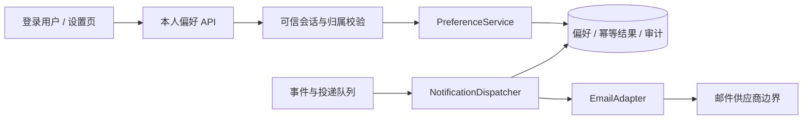

# DESIGN-001：偏好、发送门禁与界面

**教学/模拟，尚无对应代码。**行为权威来源为 [SPEC-001](spec.md)；实施见 [TASKS-001](tasks.md)；遵循[架构](../../docs/standards/architecture.md)、[UI](../../docs/standards/ui-ux.md)与[安全规范](../../docs/standards/security-privacy.md)。

## 选择与模块

教学假设：已有单一后端、关系数据库和通知 worker，采用模块化单体扩展三个边界：PreferenceService、NotificationDispatcher、EmailAdapter。UI 只调用本人偏好接口；发送适配器只接受服务端生成的投递命令。

选择理由：需要一个本地事务排序偏好更新与发送决策，已有数据库可承载。微服务会引入一致性和运行成本；仅在客户端禁用按钮无法处理重复请求、竞态和越权。真实项目若现有基础不同，应重新做选型，不能把此教学假设当成既定技术栈。

候选代码路径 `src/notifications/`、`src/ui/notification-settings/`、`tests/notifications/` 仅用于划分未来归属，不是现有文件。

## 数据与事务

| 对象 | 键/约束 | 用途与期限 |
| --- | --- | --- |
| Preference | `(tenant_id, user_id, topic)` 唯一；enabled/version | 最新授权偏好；随用户删除 |
| PreferenceOperation | 本人范围+动作+幂等键唯一；请求摘要、结果 | 重放与结果核实；24 小时 |
| Delivery | `(tenant_id, user_id, event_id, topic)` 唯一 | queued/dispatching/sent/suppressed/unknown/failed；去重 30 天 |
| Audit | 请求 ID、受限内部主体、前后值/版本、UTC 时间 | 写入与发送决策证据；30 天 |

PUT 验证可信身份及请求结构后，在事务内查重并锁住本人偏好；不存在则以唯一键安全建立版本 0。核对 expectedVersion，写入目标值、version+1、操作结果与审计，一起提交。失败不返回伪成功。被接受的新请求即使没有改变布尔值也递增，保护后发明确意图；同键重放不会再次递增。

对于操作结果查询，不返回他人记录是否存在；未查到确定结果统一 unknown。客户端看到旧重放结果后重新读取偏好，避免旧响应污染最新显示。运行错误、事务冲突与业务拒绝分别编码。

## 发送与退订边界

worker 先创建唯一 Delivery，再与 PUT 使用相同顺序锁住 Preference 和 Delivery。偏好关闭则 queued→suppressed；开启则 queued→dispatching，记录采用的偏好版本并提交，然后调用适配器。

因此：退订事务先提交，后续 queued 任务会被抑制；dispatching 事务先提交，邮件可能继续发出。数据库与供应商之间无法靠本地事务实现全局“恰好一次”；产品通过明示边界和可核实结果处理这一限制。

适配器使用稳定投递键。明确成功才能 sent；明确拒绝按原因 failed 或可安全重试；超时、进程在交接时崩溃或未知响应进入 unknown，先查询供应商/对账，再决定重试。若供应商不支持幂等或结果查询，unknown 保留人工核实，不启用自动重发。重放超过去重期限的事件必须拒绝，不将已删除记录当成可重新发送依据。

## UI 与视觉契约

页面标题“通知设置”，字段“接收产品更新邮件”，辅助文案“你可以随时退订。已开始发送的邮件可能仍会到达。”主操作“保存”，次操作“取消编辑”。采用现有项目语义 tokens：正文、弱文字、动作、焦点、边框、错误；不为该页面再建一套品牌色。

| 状态 | 内容与操作 | 恢复与辅助技术 |
| --- | --- | --- |
| 初始加载 | 显示“正在读取订阅状态”，禁用编辑 | 完成后才设定复选框值；不抢焦点 |
| 可编辑 | 原生复选框、有标签、明确保存 | 键盘可切换，取消恢复已知值 |
| 保存中 | 显示“保存中”，禁重复保存，提供“停止等待” | 说明停止等待不保证撤回 |
| 成功 | 确认最新状态 | 通过 polite 状态区播报一次，焦点留在合理位置 |
| 冲突 | 显示最新值及未提交意图 | 提供重新编辑；不自动覆盖另一窗口 |
| 失败/结果未知 | 区分尚未发送、未确认、登录失效 | 保留意图；查询/重新读取或登录后继续；不假定失败即未生效 |

目标视口与放大范围见 AC-08；布局单列，标签可换行，错误含文字，不仅使用红色。教学目标参考 WCAG 2.2 AA，但当前没有运行完整符合性评估。

## 威胁、权限和运行

| 风险 | 计划控制 | 对应证据 |
| --- | --- | --- |
| 跨租户/用户访问、操作键探测 | 会话归属注入，禁止客户端归属字段，操作查询按本人范围 | TEST-006 |
| 浏览器跨站触发写入 | 沿用已验证的会话及 CSRF 防护；真实项目需核实实现 | TEST-006 |
| 重试/乱序重新打开订阅 | 服务端幂等、版本比较、最新状态读取 | TEST-004、TEST-005、TEST-007 |
| 退订竞态、重复发送、供应商未知结果 | 行锁排序、唯一投递键、unknown 对账 | TEST-003、TEST-010 |
| 日志泄露/无界重试 | 脱敏最小字段、期限与受限访问、固定预算 | TEST-011、TEST-012 |

迁移采用新增表/索引，初始不回填为订阅，旧应用忽略新表。回滚先暂停发送 worker，保留偏好、幂等及去重记录；不得清空退订记录或重新默认开启。已发送邮件不能通过回滚撤销。监测 API 延迟/5xx、冲突与未知结果、队列积压、sent/suppressed；发布控制见 [REL-001](release.md)。

## AC 设计覆盖与验收证据

AC-01/02/04/05 由偏好 API、事务与可信身份负责；AC-03/09 由发送事务边界和适配器负责；AC-06/07/08 由 UI 恢复及状态查询负责；AC-10 由预算与观测负责。详细矩阵在 [TRACE-001](traceability.md)。

尚未执行数据库竞态、供应商故障、性能、UI 或安全验证。该设计中的可行性与恢复路径需真实实验和独立审阅支持后才能成为实施基线。
