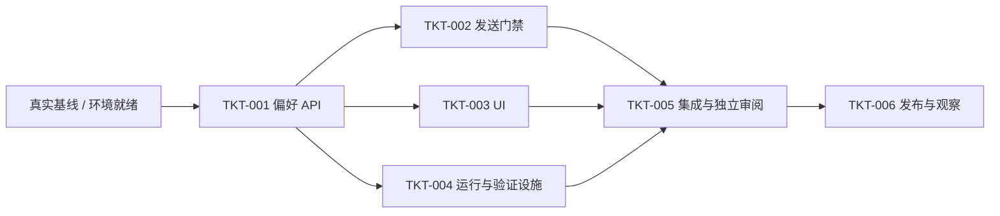

# TASKS-001：实施切片与依赖

**教学/模拟，所有 Ticket 为 backlog，未实施。**上游：[SPEC-001](spec.md)、[DESIGN-001](design.md)；验证：[QA-001](test-plan.md)。本文件暂为示例 Ticket 状态权威位置，矩阵不另设看板。

进入 ready 前必须在真实项目补齐具体执行者、可用环境、已接受基线和实际检查入口。估算仅用于演示，假设身份、数据库和 worker 已存在；不构成承诺。

| Ticket / 状态 | 教学执行角色与范围 | 上游 AC | 依赖 / 估算 | 可验收结果与计划验证 |
| --- | --- | --- | --- | --- |
| TKT-001 / backlog | 后端：偏好 API、数据迁移、操作查询；`src/notifications/preferences/` | AC-01、AC-02、AC-04、AC-05 | 基线与环境；1–2 工作日 | 本人 API、原子版本/幂等和归属拒绝；TEST-001、TEST-002、TEST-004、TEST-005、TEST-006 |
| TKT-002 / backlog | 后端/worker：发送门禁与适配器；`src/notifications/delivery/` | AC-03、AC-09 | TKT-001；1–2 工作日 | 退订排序、去重、unknown；TEST-003、TEST-010 |
| TKT-003 / backlog | 前端：页面与恢复交互；`src/ui/notification-settings/` | AC-01、AC-02、AC-03、AC-04、AC-06、AC-07、AC-08 | TKT-001；1–2 工作日 | 确认真实状态、冲突恢复、停止等待语义及键盘/视口；TEST-001、TEST-002、TEST-003、TEST-004、TEST-007、TEST-008、TEST-009 |
| TKT-004 / backlog | 平台/质量：隔离夹具、观测、预算与恢复设施；`tests/notifications/` 和测试环境配置 | AC-05、AC-09、AC-10 | TKT-001；1–2 工作日；集成需 TKT-002 | 无生产发送、脱敏观测、故障注入和恢复入口；TEST-006、TEST-010、TEST-011、TEST-012 |
| TKT-005 / backlog | 独立验收者：集成回归、威胁审阅、恢复演练 | AC-01 至 AC-10 | TKT-002/003/004；1 工作日以上，依失败调整 | QA-001 全部适用用例有真实结果、问题闭环；TEST-001 至 TEST-012 |
| TKT-006 / backlog | 发布负责人：候选制品、授权范围、逐步发布与观察 | AC-01 至 AC-10 | TKT-005；准备约 0.5 工作日，另加观察窗口 | REL-001 门槛满足；候选及发布后的适用冒烟/观测，真实版本可追溯 |

## 并行约定与范围

TKT-001 确定 API 契约和共享数据模型之后，TKT-002/003/004 可并行。共享契约、迁移与公共测试夹具由集成负责人协调；其他协作者通过明确变更请求调整，不覆盖彼此未提交改动。

本轮允许本地业务实现及隔离测试；没有对生产写入、真实发送、修改外部凭据或公开发布的实际授权。真实实施时在项目既有授权内执行，不能从教学排期推断授权。

## 验收证据与阻塞

| Ticket | 实现/PR/版本 | 检查与必要审阅 | 遗留/阻塞 |
| --- | --- | --- | --- |
| TKT-001 至 TKT-006 | 均未产生 | 均待执行 | 真实人员、运行项目和环境尚不存在；保持 backlog |

真实阻塞时写明原因、责任和下一步；done 需要每个 AC 的结果、版本、审阅与遗留项。代码生成、文档写完或把计划表填满都不满足 done。
