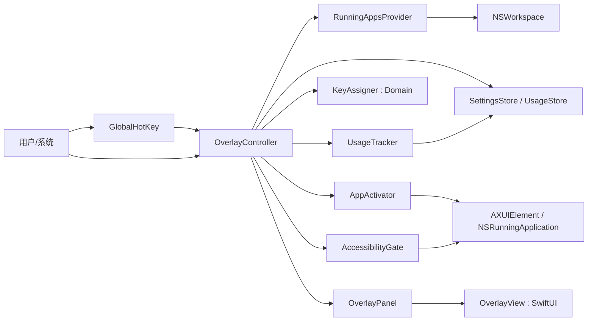

# DESIGN-001：键盘覆盖层 App 切换器的技术设计

上游：[SPEC-001](spec.md)；验证：[QA-001](test-plan.md)、[TRACE-001](traceability.md)。遵循[架构规范](../../../.framework/docs/standards/architecture.md)、[工程规范](../../../.framework/docs/standards/engineering.md)、[UI/UX 规范](../../../.framework/docs/standards/ui-ux.md)、[安全隐私规范](../../../.framework/docs/standards/security-privacy.md)。

## 方案与选择依据

| 能力 | 候选 | 选择 | 理由与退出条件 |
| --- | --- | --- | --- |
| 语言/框架 | SwiftUI / AppKit / Electron / Tauri | Swift + SwiftUI（UI）+ AppKit（窗口/热键/AX） | 原生 Apple Silicon、权限 API 直连；所有参考实现均为 Swift；Electron/Tauri 无法干净地做全局热键与非激活覆盖层且资源重。退出条件：若覆盖层窗口行为在 Swift 下无法达成则评估 AppKit 纯实现 |
| 工程 | Xcode 项目 / SwiftPM | **SwiftPM + CLT**（Domain 库 + 最小测试运行器）；Xcode 留到打包/签名阶段再装 | spike 证实 CLT+SwiftPM 可完成开发与单测（XCTest/Swift Testing 需 Xcode）；正式 .app 打包仍需 Xcode。退出条件：无 |
| 应用形态 | Dock App / 菜单栏 Agent | 菜单栏 Agent（`LSUIElement=true`） | 常驻、无 Dock 图标、符合「后台切换器」定位 |
| 全局热键 | Carbon `RegisterEventHotKey` / NSEvent 全局监视器 | Carbon `RegisterEventHotKey` | 无需辅助功能即可注册、低开销；返回错误即可做冲突检测。**spike 证实：必须打包成 .app 才能收到 Carbon 热键事件（裸二进制收不到）** |
| 激活 app | `NSRunningApplication.activate` / AX `kAXRaiseAction` | 两者分层：activate + AX setFrontmost + 还原最小化 + 抬起窗口 | 跨桌面可靠置前需要 AX（辅助功能）；最小化窗口需显式 `AXMinimized` 还原。spike 已实测通过 |
| 覆盖层窗口 | `NSPanel` 非激活 / 激活 | `NSPanel` 可激活面板，显示时 `NSApp.activate` 短暂成为前台以接收按键，取消时恢复原前台 | 非激活面板不抢焦点→字母漏进原输入框；必须让本进程短暂前台才能吃按键。spike 已实测 |
| 签名 | 无 / ad-hoc / 自签名 / Developer ID | 开发期自签名（`AppSwitcher Dev`）；分发用 Developer ID | 屏幕录制权限在 macOS 26 强制要求 TeamIdentifier，ad-hoc/自签名均拿不到；需 Developer ID（装 Xcode + Apple 账号） |
| 使用统计 | 无 / 轮询 frontmost / 事件 | 低频轮询 `NSWorkspace.frontmostApplication`（约 1s） | 无需屏幕录制即可获得「当前 app 身份」，用于 rank；纯本地 |
| 窗口枚举/标题 | AX / CGWindowList | **CGWindowList**（窗口归属/尺寸）+ `kCGWindowName` 读标题 | AX 对 Chromium（Chrome/codex）返回 0 窗口，不可靠；CGWindowList 可靠，但读标题需屏幕录制（见签名行）。无屏幕录制时降级「窗口 N」序号 |

## 模块、数据与信任边界

依赖方向严格单向：**Domain（纯函数）← Providers/Adapters（AppKit 封装）← Controller（编排）← UI（SwiftUI）**。Domain 不 import AppKit，可独立单测；UI 只依赖 Controller 暴露的窄接口。

| 模块 | 职责 | 依赖 | 类型 |
| --- | --- | --- | --- |
| `AppCandidate` / `Key` / `KeyAssigner` / `AppRanker` | 候选模型、38 键坐标、字母分配、rank 排序 | 无（纯 Swift） | Domain |
| `RunningAppsProvider` | 枚举 `NSWorkspace.runningApplications`，过滤 `.regular` 且非自身，产出名称/图标 | AppKit | Adapter |
| `UsageTracker` | 低频轮询 frontmost，写入激活次数/时间 | AppKit + Store | Adapter |
| `AppActivator` | activate + AX 兜底置前 | AppKit/ApplicationServices | Adapter |
| `GlobalHotKey` | 注册/注销热键、事件回调、冲突探测 | Carbon | Adapter |
| `AccessibilityGate` | `AXIsProcessTrusted` 检测、引导、轮询授权 | ApplicationServices | Adapter |
| `OverlayController` | 编排：热键→收集→rank→分配→显示→按键→激活/收起 | 上述 Adapter + Domain | 组合根 |
| `OverlayView` / `OverlayPanel` | 键盘形状 SwiftUI 视图 + NSPanel 容器 | AppKit/SwiftUI | UI |
| `SettingsView` | 热键录制、冲突提示 | SwiftUI | UI |
| `UsageStore` / `SettingsStore` | 本地 JSON / UserDefaults 持久化 | Foundation | 存储 |

信任边界：本应用为本地单机工具，无网络、无账号、无跨进程秘密。敏感点仅两点——「读取前台下 app 身份」与「激活其他 app」，均由系统辅助功能授权约束；存储只落 app 身份与计数/时间戳，不含窗口标题与屏幕内容。

## 关键实现约定

- 契约与状态：
  - `KeyAssigner.assign(ranked: [AppCandidate]) -> [Key: AppCandidate]`，纯函数、确定性。
  - 覆盖层状态机：`idle → showing → (activate(dismiss) | cancel(dismiss))`；同一时刻只允许一个面板实例。
  - `AppCandidate` 为值类型，`Identifiable(bundleID)`；显示名取 `localizedName`。
- 键位坐标（V1 简化网格，不模拟物理错位，记录为已知简化）：
  - Row0 `QWERTYUIOP`，Row1 `ASDFGHJKL`，Row2 `ZXCVBNM`；坐标 `(x,y)`，home row 为 `y=1`。
  - 就近让位：与理想键的欧氏距离最小；距离相同 → home row（y=1）优先 → 再更靠左（x 小）优先。
  - 数字行顺序：`1 2 3 4 5 6 7 8 9 0 - +`，仅作溢出区。
- 异常与并发：
  - 激活竞态（目标 app 在按下瞬间退出）：不伪造成功，收起后以系统实际前台为准，可打日志。
  - 使用统计写入走单串行队列 + 原子写（临时文件 + 重命名），避免半写。
  - 热键回调在主线程外，事件分发切回主线程更新 UI。
- 数据演进：`usage.json` 增加字段向后兼容（解码用可选字段 + 默认值）；`Settings` 用 `UserDefaults`。V1 无迁移需求。
- NFR：
  - 唤出 ≤150ms：候选枚举 + rank + 分配 + 面板显示均在主线程完成，分配为 O(n) 纯函数，无 IO 阻塞（统计已在后台预热）。
  - 资源：frontmost 轮询约 1s 且可暂停（当用户空闲/锁屏时停止）。
  - 隐私：无网络请求；存储脱敏（仅 bundle id/名称/计数/时间戳）。
- 运行：日志用 `OSLog`（子系统 `com.appswitcher.app`），记录热键触发、候选数、激活结果、权限状态；无遥测。

## UI 与视觉契约

- 覆盖层：键盘形状，三排字母 + 数字行 `1–0 - +`；每个键帽 = 圆角矩形，键帽内上放 app 图标、下放名称（过长截断 + `…`），空键位显示暗态空键帽。
- 层级/材质：半透明深色键帽（自动适配浅色/深色），名称文字与键帽对比度满足可读性。
- 布局：面板定位在当前活动显示器（鼠标所在屏）中下部居中；宽度约 700pt（Q 到 P 一行的自然宽度）。
- 状态：`idle`（无面板）→ `showing`（面板，键帽高亮候选）；激活成功后淡出收起（不展示「切换中」假状态）。
- 设置窗口：热键录制控件 + 当前值 + 冲突提示文字（非仅颜色）；后续迭代加入手动固定键位表格。
- 可访问性：全程键盘可操作；键帽信息以图标+文字双重表达（不只靠颜色区分）；评估 V1 覆盖层对 200% 放大的适用性并在 [QA-001](test-plan.md) 记录结论。

## AC 到设计

| AC | 设计位置/责任模块 | 验证方式 | 未决风险 |
| --- | --- | --- | --- |
| AC-01 | `OverlayController` + `OverlayPanel` + `GlobalHotKey` | TEST-001 | 面板定位到活动显示器需实测 |
| AC-02 | `RunningAppsProvider` 过滤逻辑 | TEST-002 | `.regular` 策略是否漏掉某些 app 需实测 |
| AC-03 | `KeyAssigner` 确定性 | TEST-003 | 无（纯函数单测） |
| AC-04 | `KeyAssigner` 冲突/就近/溢出 | TEST-004 | 无（纯函数单测） |
| AC-05 | `AppActivator`（activate + AX 兜底） | TEST-005 | **跨桌面置前与回弹为最大风险，spike 实测** |
| AC-06 | `OverlayController` 取消路径 | TEST-006 | 点外部的事件监视器覆盖范围 |
| AC-07 | `OverlayController` 重新分配 | TEST-007 | 无 |
| AC-08 | `AccessibilityGate` | TEST-008 | 授权轮询与跳转 URL 在 macOS 26 的可用性 |
| AC-09 | `GlobalHotKey` + `SettingsView` | TEST-009 | 冲突探测依赖 RegisterEventHotKey 返回 |
| AC-10 | `OverlayView` + 整体流程 | TEST-010 | 空态/截断为纯 UI |

## 实施切片与验收证据

- 前置契约：`AppCandidate`/`Key`/`KeyAssigner` 接口先定（纯 Swift，无平台依赖），供 Provider/UI 并行。
- 风险 spike 先行：TKT-001 验证权限、热键、激活、覆盖层四件事的可行性，结论回填本设计与 SPEC-001。
- 切片与依赖见 [TASKS-001](tasks.md)；可并行项（Domain 单测、UI 快照、Provider 适配）在契约冻结后并行。

## TKT-001 spike 结论回填

已在真实环境（macOS 26.6.2 / Apple Silicon / CLT Swift 6.3.3）实测：

1. **热键必须打包成 .app**：裸可执行文件收不到 Carbon 热键事件；手工 .app 壳（Info.plist + 二进制 + 签名）即可解决。
2. **覆盖层必须短暂激活**：非激活面板不抢焦点，字母会漏进原输入框；需 `NSApp.activate` + 可成为 key 的 panel，取消时恢复原前台。
3. **窗口过滤**：用 `CGWindowList`（layer==0 + 尺寸阈值，排除菜单栏条 33px 与 500×500 占位窗），零额外权限，正确排除后台/菜单栏 app。
4. **多窗口平铺**：用 `CGWindowList` 枚举（可靠）；同 App 多窗口展开为相邻键位。AX 枚举对 Chromium（Chrome/codex）返回 0，不可依赖。
5. **窗口标题受签名限制**：`kCGWindowName` 需屏幕录制；macOS 26 强制 TeamIdentifier，ad-hoc/自签名均拿不到。**无屏幕录制时降级为「窗口 N」序号**（已实现）。
6. **中文名**：首字母映射对中文显示名失效，需拼音/英文名兜底（列入后续 ticket，不在 V1）。
7. **最小化 app**：激活需显式 `AXMinimized` 还原，否则无窗口显示。

- 验收证据：spike 可运行、覆盖层/热键/激活/多窗口平铺均人工验证；Domain 单测 `swift run CoreTests` 17 项通过（最小测试运行器，无 Xcode）。技术审阅与发布前完整验收待 TKT-003 之后。
