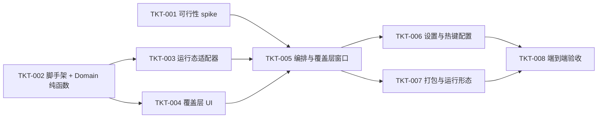

# TASKS-001：实施切片与依赖

上游：[SPEC-001](spec.md)、[DESIGN-001](design.md)；验证：[QA-001](test-plan.md)。权威状态位置：本文件（暂未接入外部看板；接入后改为平台直达链接，避免双写）。

所有 Ticket 为 `backlog`，进入 `ready` 前须补齐执行者、可用环境、已 accepted 基线与实际检查入口。估算为单人工期区间，不含 spike 返工与集成收尾，不构成承诺。

| Ticket / 状态 | 范围与归属 | 上游 AC | 依赖 / 估算 | 可验收结果与计划验证 |
| --- | --- | --- | --- | --- |
| TKT-001 / done | 可行性 spike（一次性原型）：权限检测+引导、全局热键注册、activate+AX 激活、NSPanel 覆盖层 | AC-05、AC-08 | 无 | commit `c9e8053`；四件事本机实测，结论回填 SPEC/DESIGN |
| TKT-002 / done | 工程脚手架 + Domain：`Key`/`Candidate`/`AppRanker`/`KeyAssigner` 纯函数 | AC-03、AC-04 | 无 | commit `9e2f893`；`swift run CoreTests` 单测通过 |
| TKT-003 / done | 运行态适配器：`RunningAppsProvider`/`UsageTracker`/`UsageStore` + 纯函数 `WindowFilter`/`CandidateFactory` | AC-02、AC-07 | TKT-002 | commit `072407d`；`swift run CoreTests` 29 项通过 |
| TKT-004 / done | 覆盖层 UI：`OverlayView`（SwiftUI 键盘形状、名称+副标题+键位字母、空态、截断） | AC-01、AC-10（显示部分） | TKT-002 | 随 TKT-005 打包，人工可渲染 |
| TKT-005 / done | 编排与覆盖层窗口：`OverlayController`/`OverlayPanel`/`GlobalHotKey`/`AppActivator` 集成 | AC-01、AC-05、AC-06、AC-07 | TKT-001+003+004 | App 可启动、热键注册=true、端到端唤出/切换/取消待人工验收 |
| TKT-006 / in-progress | 设置与热键配置：`SettingsView`（热键录制+冲突检测）**未完成**；菜单栏（About/Quit）+`AccessibilityGate` 已完成 | AC-08、AC-09 | TKT-005 | 遗留：热键 UI 录制/冲突检测待做（当前热键硬编码 ⌃⌥+Space） |
| TKT-007 / done | 打包与运行形态：`LSUIElement` 菜单栏 agent、自签名、`scripts/build_app.sh` 产物 `.app` | AC-10、整体可运行 | TKT-005 | `build/AppSwitcher.app` 已生成、自签名、`open` 启动成功 |
| TKT-008 / in-progress | 端到端验收：执行 [QA-001](test-plan.md) 全部适用用例、跨桌面实测、产出 [发布记录](release.md) | AC-01 至 AC-10 | TKT-006/007 | 待 owner 整体验收；REL 记录版本与观测 |

## 并行约定与范围

- TKT-001（一次性原型）与 TKT-002（正式 Domain）可并行：前者用一次性临时工程，后者先冻结纯函数契约。
- TKT-002 冻结 `AppCandidate`/`Key`/`KeyAssigner` 接口后，TKT-003 与 TKT-004 可并行。
- 共享契约（Domain 类型、存储 schema）由集成负责人协调；协作者通过明确变更请求调整，不覆盖他人未提交改动。
- 本轮仅允许本地实现与隔离测试；无对外发布、修改外部凭据或联网动作的授权。V1 为个人使用（ad-hoc 签名），开放给他人是后续目标。

## 验收证据与阻塞

| Ticket | 实现/PR/版本 | 检查与必要审阅 | 遗留/阻塞 |
| --- | --- | --- | --- |
| TKT-001 | `c9e8053` | 人工实测热键/面板/激活 | 无 |
| TKT-002 | `9e2f893` | `swift run CoreTests` 通过 | 无 |
| TKT-003 | `072407d` | `swift run CoreTests` 29 项通过 | 无 |
| TKT-004/005/007 | 本次提交 | 编译通过、`.app` 生成并启动、热键注册=true | 端到端交互待 owner 验收 |
| TKT-006 | 部分 | 菜单栏 + 权限引导完成 | 热键录制/冲突检测 UI 未做 |
| TKT-008 | 待验收 | 见 [REL-001](release.md) | 等待 owner 整体验收 |

`done` 需要每个 AC 对应的真实结果、代码/文档版本、必要审阅与遗留项；TKT-008 的端到端人工验收由 owner 执行。
