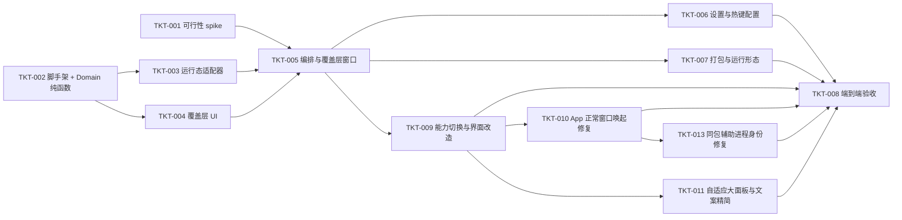

# TASKS-001：实施切片与依赖

上游：[SPEC-001](spec.md)、[DESIGN-001](design.md)；验证：[QA-001](test-plan.md)。权威状态位置：本文件（暂未接入外部看板；接入后改为平台直达链接，避免双写）。

历史切片保留原完成证据；2026-09-24 新行为由 TKT-009 跟踪，不把历史编译或旧数字窗口演示当作新契约验收。owner 已接受 RES-002 建议并授权系统修改与整体界面优化，当前基线见 SPEC-001。状态以本表及证据表为准。

安装后用户报告 S 不能唤起 Spotify；TKT-010 修复 App 激活只获得前台 PID、却未请求正常窗口呈现的缺口，目标版本 0.2.1。保留 0.2.0 的历史验证事实，同时补其未覆盖的窗口状态回归。

后续用户要求放大整体面板、充分适配屏幕并去掉重复「应用」字样，TKT-011 负责本次局部 UI 调整，已完成本地版本 0.2.2 更新。

用户继续要求自定义快捷键，现按唤出面板组合键完成既有 TKT-006，目标本地版本 0.3.0；增加设置入口、录制、冲突 / 回滚、持久化和 F→J 开关，不修改目标选择与激活路径。

用户后续报告选择微信后覆盖层再次出现。现场已定位同一安装路径的 `wxplayer` 辅助进程被误判为另一微信主实例；TKT-013 已完成身份守卫修复及回归，本地版本 0.3.2 已安装并通过真实微信点击验证。WorkBuddy 原始失败未复现，不据此合并为同一原因。

| Ticket / 状态 | 范围与归属 | 上游 AC | 依赖 / 估算 | 可验收结果与计划验证 |
| --- | --- | --- | --- | --- |
| TKT-001 / done | 可行性 spike（一次性原型）：权限检测+引导、全局热键注册、activate+AX 激活、NSPanel 覆盖层 | AC-05、AC-08 | 无 | commit `c9e8053`；四件事本机实测，结论回填 SPEC/DESIGN |
| TKT-002 / done | 工程脚手架 + Domain：`Key`/`Candidate`/`AppRanker`/`KeyAssigner` 纯函数 | AC-03、AC-04 | 无 | commit `9e2f893`；`swift run CoreTests` 单测通过 |
| TKT-003 / done | 运行态适配器：`RunningAppsProvider`/`UsageTracker`/`UsageStore` + 纯函数 `WindowFilter`/`CandidateFactory` | AC-02、AC-07 | TKT-002 | commit `072407d`；`swift run CoreTests` 29 项通过 |
| TKT-004 / done | 覆盖层 UI：`OverlayView`（SwiftUI 键盘形状、名称+副标题+键位字母、空态、截断） | AC-01、AC-10（显示部分） | TKT-002 | 随 TKT-005 打包，人工可渲染 |
| TKT-005 / done | 编排与覆盖层窗口：`OverlayController`/`OverlayPanel`/`GlobalHotKey`/`AppActivator` 集成 | AC-01、AC-05、AC-06、AC-07 | TKT-001+003+004 | App 可启动、热键注册=true、端到端唤出/切换/取消待人工验收 |
| TKT-006 / done（实现与本地验证） | 独立原生设置窗、菜单 / 齿轮入口、唤出组合键录制、F→J 开关、校验 / 冲突反馈、注册与配置回滚、重启保持；既有权限引导保留 | AC-01、AC-08、AC-09 | TKT-005/011；用户自定义快捷键要求 | 集成负责人实现与本机验证，文档协作者同步。默认 ⌃⌥Space；录制限本窗，取消 / 失焦 / 关闭恢复；保存立即生效，失败不丢旧值，独立配置不改 usage；TEST-009 规则、注册、保存与重启证据见QA-001；其余人工交互由TKT-008跟踪 |
| TKT-007 / done | 打包与运行形态：`LSUIElement` 菜单栏 agent、自签名、`scripts/build_app.sh` 产物 `.app` | AC-10、整体可运行 | TKT-005 | `build/AppSwitcher.app` 已生成、自签名、`open` 启动成功 |
| TKT-008 / in-progress | 端到端验收：执行 [QA-001](test-plan.md) 的新版 Spotify / 其他真实 App、权限、跨桌面 / 全屏、性能与可访问性场景 | AC-01 至 AC-13 | TKT-006/007/009/010/011/013 | 待实际兼容与体验验收；REL 记录版本与观测，不以合成夹具替代用户常用 App |
| TKT-009 / done（实现与本地验证） | 默认 App 模式、Tab 按能力窗口模式、AX 对象 token、目标恢复与读回验证、异步会话、完整 38 键与方向导航、石墨 / SF / 图标 UI、规格同步 | AC-01 至 AC-08、AC-10 至 AC-13 的本地实现；完整环境验收属 TKT-008 | 现有 TKT-002/003/004/005；依据 RES-002 与 owner 本轮授权 | Codex 集成负责人及 Domain / 系统、UI、文档协作者完成。Debug 构建无警告，60 项规则测试、九张合成预览目视检查、Debug / Release 跨进程隔离 AX 验证、Release 打包验签通过；真实第三方兼容等遗留见 TKT-008 |
| TKT-010 / done（实现与受控验证） | App 入口对唯一运行实例请求正常 reopen、回调复核 PID / 启动时间、yield 后激活原进程；边界守卫及 AppActivationProbe，不改 UI / 排序 / 窗口 token 路径 | AC-05、AC-07、AC-12 的修复与受控验证；现场属 TKT-008 | TKT-009；用户 Spotify 唤起缺陷反馈 | Codex 集成、系统适配与文档协作者完成。Debug 构建、CoreTests 60 项、Debug / Release App 四状态及既有窗口 probe 均通过；0.2.1 已本机安装。多实例 / 替换返回和 reopen 在途取消仅守卫审阅；Spotify 新版现场仍待验 |
| TKT-011 / done（实现与本地视觉验证） | 面板按活动屏 92% 宽 / 82% 高适配、键帽及图标文字同步增大；应用模式去掉重复「应用」与空副标题行，保留真实窗标题 / 回退 / 无障碍语义 | AC-10 | TKT-009/010；用户明确 UI 调整要求 | Codex 集成负责人负责 UI / 预览 / 安装，文档协作者同步契约。Debug / Release 构建无警告，13 张合成预览全部目视、独立审阅及窄键帽重叠修正复核完成；严格验签通过，0.2.2 已本机安装并启动。本轮不运行原生焦点探针 |
| TKT-012 / done（实现与本地视觉验证） | 应用图标随键帽显著放大，预留长名称、窗口说明与键标空间 | AC-10 | TKT-011；用户要求图标更显眼清晰 | 16场景视觉与独立边界审阅、最终Debug/Release构建和严格验签通过；0.3.1已安装运行，⌘E配置保留。制品/回退见REL-001；未复验真实按键 |
| TKT-013 / done（已确认缺陷的修复与验证） | 同安装路径不同可执行文件 helper 不再被误判为主应用多实例；保留未知身份、真实多实例及 reopen 回调身份保护；扩展隔离 AppActivationProbe | AC-05、AC-07 | TKT-010；用户微信切换失败反馈；本地 0.3.2 | 旧守卫四状态全部失败，修复后 Debug / Release 五场景全通过，含 helper 共存时原进程呈现和真实同 exe 多实例拒绝；CoreTests 75/75、独立只读复核、严格验签通过。0.3.2 已安装，实际点击微信后原进程前台、正常窗口可见且最前，面板未重现；未知路径仅守卫审阅，其余第三方边界见 TKT-008 |

## 并行约定与范围

- TKT-001（一次性原型）与 TKT-002（正式 Domain）可并行：前者用一次性临时工程，后者先冻结纯函数契约。
- TKT-002 冻结 `AppCandidate`/`Key`/`KeyAssigner` 接口后，TKT-003 与 TKT-004 可并行。
- 共享契约（Domain 类型、存储 schema）由集成负责人协调；协作者通过明确变更请求调整，不覆盖他人未提交改动。
- 本轮系统实现与 UI 优化包括必要本地检查和可控测试窗口，不扩展为对外发布、修改外部凭据或外部数据写入。开放分发是后续目标。
- TKT-009 所有权：Domain / 系统适配维护目标模型和 AX 行为，UI 维护面板视图，文档维护规格链路，集成负责人维护 Controller / 输入 / 构建与最终证据。任何交叉接口先沟通，不覆盖他人未提交修改；保留既有 F+J 手势及回放行为。

## 验收证据与阻塞

| Ticket | 实现/PR/版本 | 检查与必要审阅 | 遗留/阻塞 |
| --- | --- | --- | --- |
| TKT-001 | `c9e8053` | 人工实测热键/面板/激活 | 无 |
| TKT-002 | `9e2f893` | `swift run CoreTests` 通过 | 无 |
| TKT-003 | `072407d` | `swift run CoreTests` 29 项通过 | 无 |
| TKT-004/005/007 | 本次提交 | 编译通过、`.app` 生成并启动、热键注册=true | 端到端交互待 owner 验收 |
| TKT-006 | 2026-09-24 工作区，0.3.0，done（实现与本地验证） | CoreTests75项、Debug/Release真实Carbon注册与回滚、四场景视觉、构建/严格验签通过；用户保存⌘E/FJ关闭，重启注册true。制品与PID见REL-001 | 部分人工交互、真实组合唤出/手势完整矩阵仍属TKT-008；冲突检测不覆盖全部第三方非排他注册、监听或局部键 |
| TKT-008 | 待验收 | 见 [REL-001](release.md) | 等待 owner 整体验收 |
| TKT-009 | 2026-09-24 工作区，0.2.0 本地制品；具体构建身份见 REL-001 | Debug 构建、CoreTests 60/60、九张预览、打包和严格验签、打包前后跨进程 AX probe 均通过；多 Agent 只读审阅发现的集合刷新 / 修饰键 / 容量提示问题已修复，详见 QA-001 | ClassIn / 微信 / Chrome、Space / 全屏、150ms、完整 F+J / IME / VoiceOver 仍属 TKT-008 未验矩阵；热键配置仍为 TKT-006 |
| TKT-010 | 2026-09-24 工作区，0.2.1 已本机安装；制品见 REL-001 | 红：临时 harness 两次 exit 1，最小化 / 最后窗口关闭时 success 但 visible=0；绿：同夹具最小修复、正式 Debug / Release App 四状态及既有窗口 probe 全通过，CoreTests 60 项、无警告构建、打包 / 严格验签通过，见 QA-001 | CUA 未确认新版 S 被执行，Spotify 现场待用户重试；原始窗口状态未知；多实例 / 替换返回 / reopen 在途取消未端到端实测，均未冒称通过 |
| TKT-011 | 2026-09-24 工作区；0.2.2 已本机安装，制品见 REL-001 | 最终 Debug 构建、13 张预览生成及 Release 打包 exit 0、无警告；13 场景全部目视，独立审阅发现的窄短屏图标 / 键标重叠修复后复核通过，严格验签与单实例启动通过，详见 QA-001 | 本轮未做真实用户面板的自动键盘复验，不重复未改动的原生焦点探针；原有 Spotify / 真实 App / 输入 / 可访问性待验范围不变 |
| TKT-013 | 2026-09-25 工作区，0.3.2 已本机安装，最终 PID 98688；制品见 REL-001 | 现场 11 次微信误拒绝定位到同 bundle 的 `wxplayer`；旧守卫隔离四状态 4/4 失败且 reopen=0，修复后 Debug / Release 5/5 通过，CoreTests 75/75、独立只读复核和严格验签通过。CUA 点击「4，微信，应用入口」后原 PID 72924 前台、正常窗口数 1 且最前，helper PID 73161 仍在，面板未重现，见 QA-001 | 未知 executableURL、替换回调及 reopen 在途取消未系统注入；WorkBuddy 原始失败仍未复现，不能据微信修复结案；跨 Space / 全屏等完整矩阵继续由 TKT-008 跟踪 |

`done` 需要每个 AC 对应的真实结果、代码/文档版本、必要审阅与遗留项；TKT-008 的端到端人工验收由 owner 执行。
