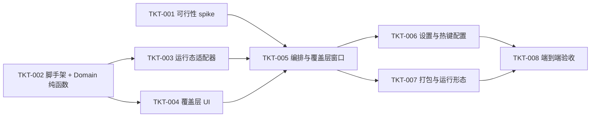

# TASKS-001：实施切片与依赖

上游：[SPEC-001](spec.md)、[DESIGN-001](design.md)；验证：[QA-001](test-plan.md)。权威状态位置：本文件（暂未接入外部看板；接入后改为平台直达链接，避免双写）。

所有 Ticket 为 `backlog`，进入 `ready` 前须补齐执行者、可用环境、已 accepted 基线与实际检查入口。估算为单人工期区间，不含 spike 返工与集成收尾，不构成承诺。

| Ticket / 状态 | 范围与归属 | 上游 AC | 依赖 / 估算 | 可验收结果与计划验证 |
| --- | --- | --- | --- | --- |
| TKT-001 / backlog | 可行性 spike（一次性原型，非交付代码）：权限检测+引导、全局热键注册、activate+AX 激活、NSPanel 在当前活动屏/所有 Space 显示 | AC-05、AC-08（验证其可行性） | 无；timebox 0.5–1 天 | 四件事均可在本机复现并有记录；结论回填 SPEC/DESIGN（跨桌面行为、权限路径） |
| TKT-002 / backlog | 工程脚手架 + Domain：Xcode 项目；`AppCandidate`/`Key`/`KeyAssigner`/`AppRanker` 纯函数与单元测试 | AC-03、AC-04 | 无（可与 TKT-001 并行）；1–2 天 | 纯 Swift 单测覆盖分配确定性、冲突就近让位、溢出、rank 排序；`KeyAssigner` 无 AppKit 依赖 |
| TKT-003 / backlog | 运行态适配器：`RunningAppsProvider`（枚举+过滤+名称/图标）、`UsageTracker`（frontmost 轮询）、`UsageStore`/`SettingsStore` | AC-02、AC-07 | TKT-002；1 天 | 过滤 `.regular` 且非自身、统计原子写、候选映射到 `AppCandidate`；适配器单测 |
| TKT-004 / backlog | 覆盖层 UI：`OverlayView`（键盘形状、键帽 icon+名称、空态、截断）+ 快照测试 | AC-01、AC-10（显示部分） | TKT-002；1–2 天 | 键盘形状视图可渲染、截断与空态正确；UI 快照/预览 |
| TKT-005 / backlog | 编排与覆盖层窗口：`OverlayController`/`OverlayPanel`/`GlobalHotKey`/`AppActivator` 集成，串起热键→候选→rank→分配→显示→按键激活→取消 | AC-01、AC-05、AC-06、AC-07 | TKT-001 + TKT-003 + TKT-004；2–3 天 | 端到端可唤出/切换/取消；跨桌面跟随；取消三路径均无副作用 |
| TKT-006 / backlog | 设置与热键配置：`SettingsView`（热键录制+冲突检测）、`AccessibilityGate` 正式化（检测/引导/授权轮询） | AC-08、AC-09 | TKT-005；1–2 天 | 可改唤出键、冲突提示、保存即生效；首次未授权显示单页引导、授权后自动继续 |
| TKT-007 / backlog | 打包与运行形态：`LSUIElement` 菜单栏 agent、ad-hoc 签名、登录自启、产物 `.app` | AC-10（不请求屏幕录制）、整体可运行 | TKT-005；0.5–1 天 | 产物可在本机运行；Info.plist 未声明屏幕录制权限；无 Dock 图标 |
| TKT-008 / backlog | 端到端验收：执行 [QA-001](test-plan.md) 全部适用用例、跨桌面实测、产出 [发布记录](release.md) | AC-01 至 AC-10 | TKT-006/007；1 天以上，依失败调整 | QA-001 用例有真实结果、问题闭环；REL 记录版本与观测 |

## 并行约定与范围

- TKT-001（一次性原型）与 TKT-002（正式 Domain）可并行：前者用一次性临时工程，后者先冻结纯函数契约。
- TKT-002 冻结 `AppCandidate`/`Key`/`KeyAssigner` 接口后，TKT-003 与 TKT-004 可并行。
- 共享契约（Domain 类型、存储 schema）由集成负责人协调；协作者通过明确变更请求调整，不覆盖他人未提交改动。
- 本轮仅允许本地实现与隔离测试；无对外发布、修改外部凭据或联网动作的授权。V1 为个人使用（ad-hoc 签名），开放给他人是后续目标。

## 验收证据与阻塞

| Ticket | 实现/PR/版本 | 检查与必要审阅 | 遗留/阻塞 |
| --- | --- | --- | --- |
| TKT-001 至 TKT-008 | 均未产生 | 均待执行 | 保持 backlog |

`done` 需要每个 AC 对应的真实结果、代码/文档版本、必要审阅与遗留项；生成代码或填写表格不满足完成定义。阻塞时写明原因、责任与下一步。
