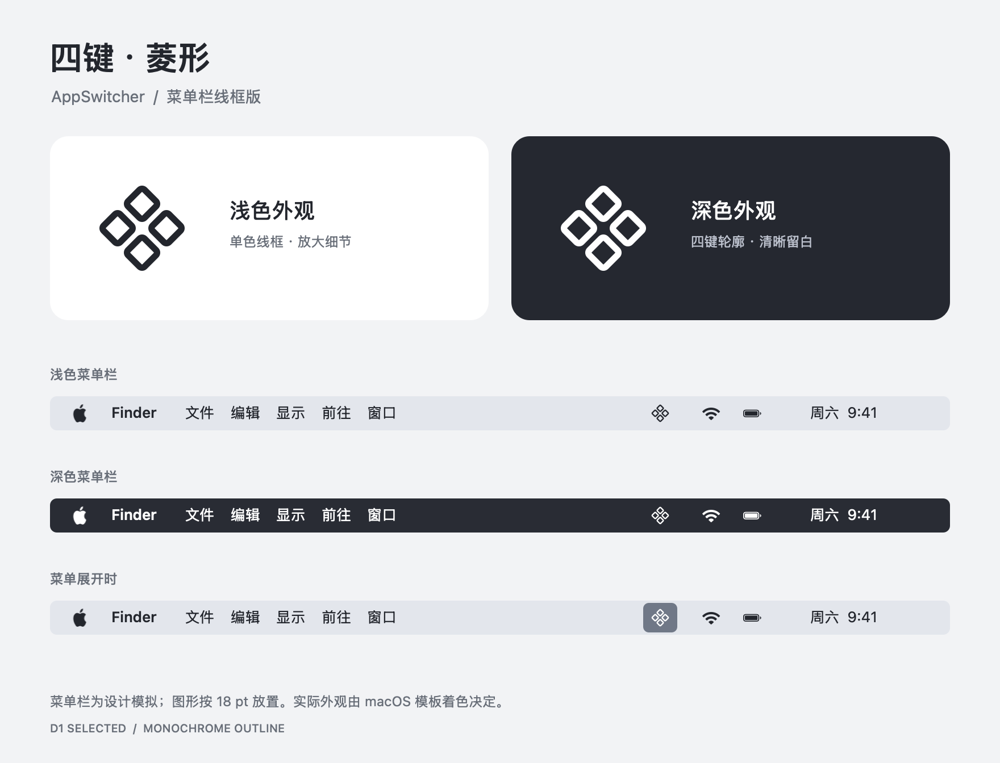
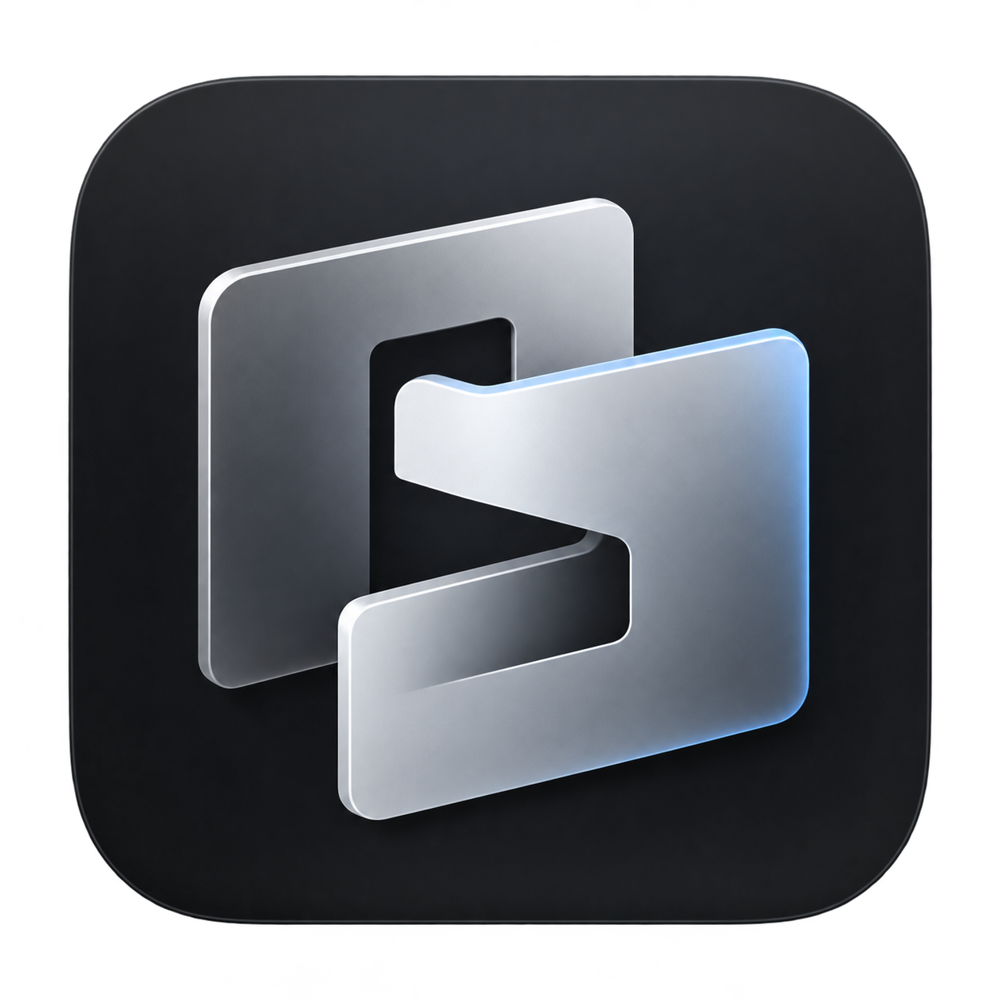
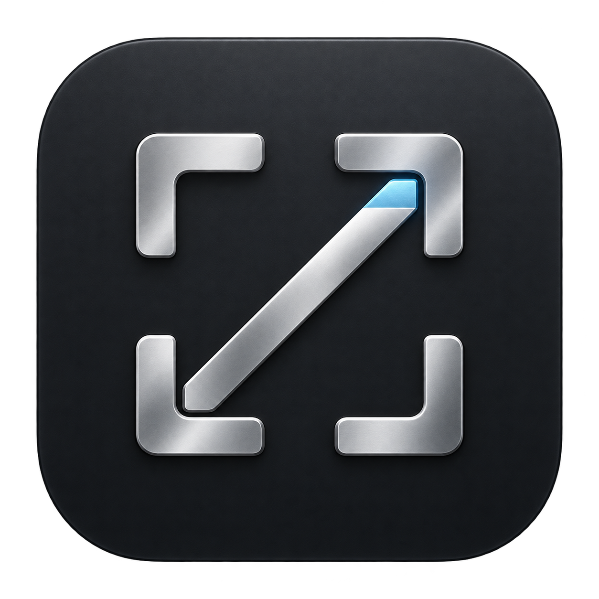
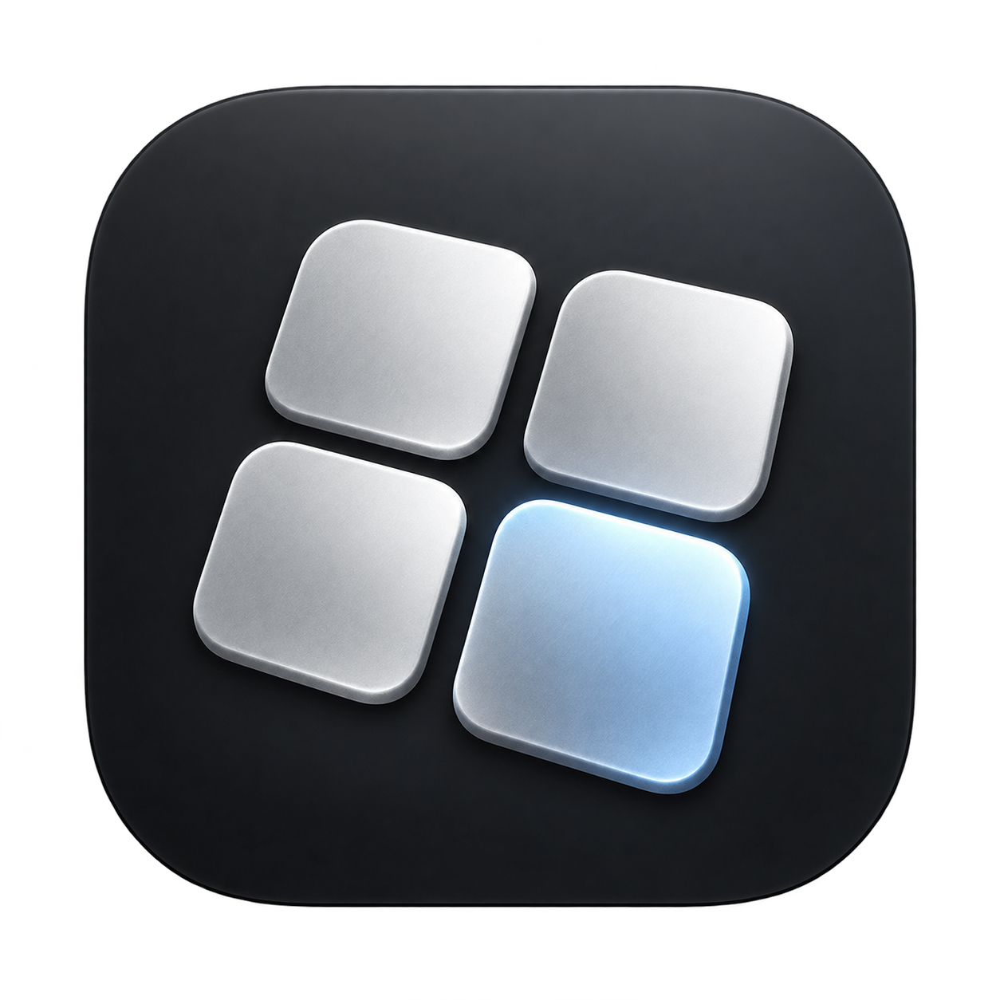
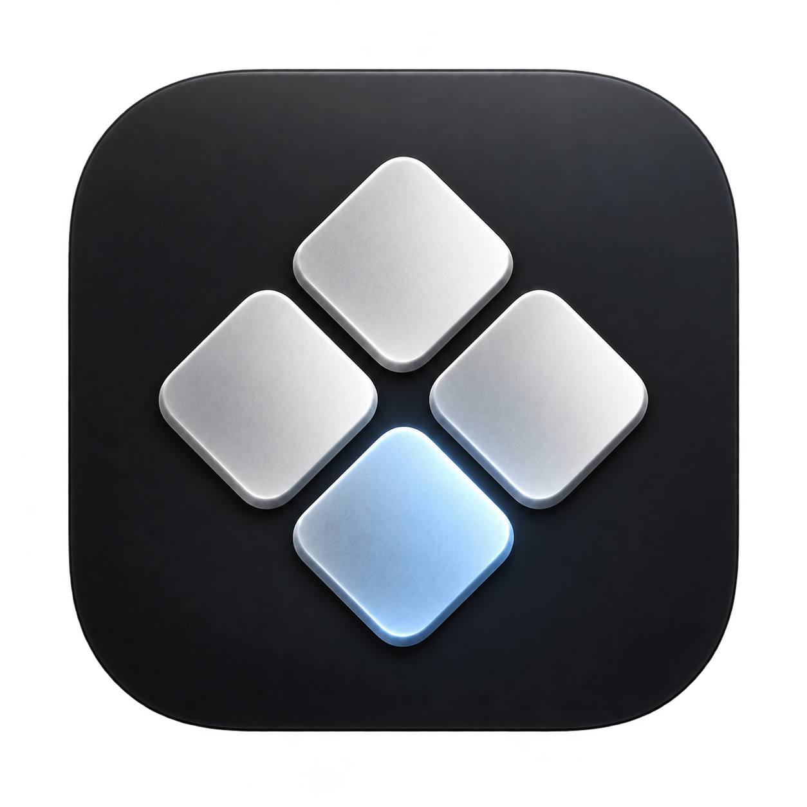
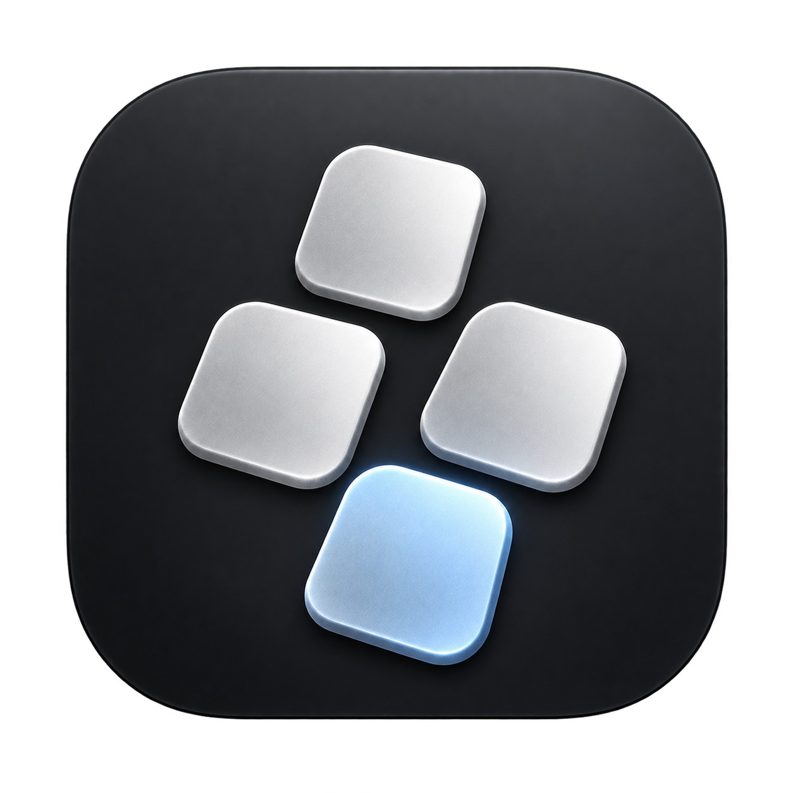

# AppSwitcher 命名与图标探索（2026-09-26）

状态：用户于 2026-09-26 选定 D1「整组旋转」菱形版本，随后确认对应的菜单栏单色线框效果并要求保存设计历史。[选定母版与菜单栏资产](../../../assets/branding/README.md)为后续接入入口；产品名尚未另行确认。

## 确认与历史归档

- 日期：2026-09-26；版本：v1；状态：用户确认。
- 应用图标：D1 整组旋转；四颗银色键帽组成菱形，底部冰蓝色高亮。
- 菜单栏：四个圆角菱形单色线框；确认范围包含浅色、深色和菜单展开三种模拟效果。
- 用户反馈：“这个效果没问题，特别好。把这个图片也保存下来，形成我们设计的过往历史记录。”
- [已确认菜单栏效果图 v1](menu-bar-approved-v1.png)：从当前品牌资产逐字节复制，SHA-256 为 `c9a481dba26ac287b87e16b61030b3e42c8287f4d613f6f10f88a7773a898c2a`。
- 原始 A/B/C/D、D1/D2 图均保留。后续修改新增版本及记录，不覆盖本次已确认快照。

## 设计依据

- 产品核心是通过键盘确定性键位，在运行中的 App 与可精确控制的窗口之间快速切换，见 `PROJECT.md` 和 `CONTEXT.md`。
- 兄弟项目 Relay 的 `../../../../20260914-network诊断/assets/logo/Relay-logo-final.png`：深色圆角底、银色信号符号，单一视觉焦点。
- 兄弟项目 VoiceDraft 的 `../../../../202609-typeleast/docs/design/assets/voicedraft-logo-v2/voicedraft-logo-v2.png`：石墨底、缎面银色主体、克制的冰蓝边缘。
- 沿用两者的材质、色调和留白语言；不复制 Relay 的信号弧或 VoiceDraft 的 V 形。

## 图标候选

| 代号 | 图 | 含义 | 初评 |
| --- | --- | --- | --- |
| A 选中键 |  | 三颗键帽中，前方一颗被点亮 | 键盘属性最明确，但“切换”的动作感较弱。 |
| B 叠层切换 |  | 两个前后交错的窗口/应用平面，中央形成转移路径 | 初评首选：含义与识别形状较均衡，也能与 `SwitchArc` 的 S 呼应。 |
| C 焦点通道 |  | 焦点从左下移到右上 | 动势强，但容易被读成“放大/全屏”。 |
| D 选中矩阵 |  | 四个目标中选中一个 | 简洁、与现有键盘矩阵接近，但四方格构图较常见。 |

四张均为 1254 × 1254 PNG，圆角外透明，仅供方向遴选；尚未验证 Dock 16–64 px、深浅背景、系统模板色及图标资产生成质量。生成式图像中细节和光影需在定稿时重绘/规整。

### D 款菱形迭代（用户偏好）

用户偏好 D 款，并提出由键盘按键构成菱形。保留 D 原稿，新增两个互不覆盖的方向：

| 代号 | 图 | 做法 | 初评 |
| --- | --- | --- | --- |
| D1 整组旋转 |  | 四键 2×2 组合整体旋转约 45°，蓝键在下方 | 菱形轮廓更完整，视觉更凝练；单键更像菱形块。 |
| D2 正向键帽 |  | 四键按上、左/右、下的 1–2–1 排列，单键保持近似正向 | 更能读出实体键帽，但外轮廓相对松散。 |

两张由内置 imagegen 以 D 原稿为编辑目标生成；背景、材质、冰蓝选中键及圆角外透明是保持项。用户已选定 D1；D2 留作探索记录。对应菜单栏采用四菱形单色圆角线框，提供浅色、深色和高亮模拟。实际产品接入与系统小尺寸验收在接入时完成。

### 生成提示词集合

共同约束：`Premium macOS app icon, graphite rounded-square tile, satin-platinum sculptural emblem, restrained icy-blue accent, generous negative space, centered single symbol, clean material lighting, transparent outside tile, no words, no letters, no copied logo.`

- A：`Three compact physical keycaps in a triangular stack; one front key subtly active with icy-blue underglow; communicate keyboard selection.`
- B：`Two interlocking offset application/window planes; an S-like negative-space passage between them suggests switching focus; one cool-blue edge reflection.`
- C：`Four corner focus brackets with a diagonal route from lower-left to upper-right, ending at a blue-lit destination.`
- D：`A 2×2 matrix of softly raised square targets; one lower-right target lit blue to indicate the chosen app.`
- D1 编辑提示词：`Image 1 is the edit target. Rotate the entire existing 2×2 four-key cluster clockwise approximately 45 degrees as one rigid group so its overall silhouette is a clear diamond. Preserve recognizable beveled keyboard-key form, separated gaps, equal size, spatial perspective, platinum material, and the single icy-blue selected key at the same relative bottom-right position. Keep graphite rounded-square tile, margins, lighting, shadows, accent intensity, and transparent exterior unchanged. Center the cluster. No new elements or text.`
- D2 编辑提示词：`Image 1 is the edit target. Change only the spatial arrangement of exactly four raised keyboard keycaps into a balanced diamond: one at the top, two side-by-side in the middle, one at the bottom. Keep each keycap approximately upright, tactile and beveled; do not rotate each one into a diamond. Bottom key alone remains icy blue; other three satin platinum. Preserve original graphite tile, margins, lighting, shadows, materials, and transparent exterior. No letters, arrows, extra keys or watermark.`

以上是本轮视觉方向的提示词摘要，不是可直接交付的矢量设计规范。

## 命名候选

| 名称 | 适用方式 | 评价 |
| --- | --- | --- |
| `SwitchArc` | 英文品牌候选；副标题“键盘切换 App 与窗口” | 有切换轨迹与跨目标移动的意象，和 B 图形较合；初步网页检索未发现明确同名切换器，但**不代表商标、域名或商店名称可用**。 |
| `键跃` | 中文品牌候选；可与英文功能说明并列 | 两字简短，强调按键后跳转；与 B 的抽象窗口图形结合需配文案说明。 |
| `AppSwitcher` | 保留为功能描述或开发代号 | 一看就懂，但同名的 [macOS 工具](https://github.com/sponrad/appswitcher)和 [App Store 产品](https://apps.apple.com/us/app/appswitcher-clean-app-switch/id1575587195?mt=12)已存在，正式品牌区分度较弱。 |

当前进度：D1 图标已选定；名称尚未定。发布前做商标、App Store、域名与社媒名称的完整检索。即使最终改名，也不必立即改仓库名或程序内部标识。
