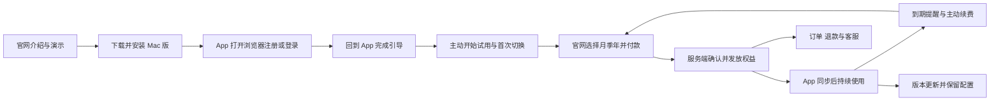

# AppSwitcher 商业化里程碑

日期：2026-09-25。用户随后明确授予自主决策与目标模式实施，本计划已落实为 [SPEC-002](../features/FEAT-002-commercialization/spec.md)、[任务](../features/FEAT-002-commercialization/tasks.md)与[验证记录](../features/FEAT-002-commercialization/verification.md)。官网、账号、国内渠道适配、Mac授权和正式发布脚本已实现并进入联调；真实收款、生产部署及公证分发仍待外部条件。Windows后置。当前用户安装的0.3.2事实和遗留问题仍以[发布记录](../features/FEAT-001-app-switcher/release.md)为准。

已采用[首发商业规则与售后设计](commercialization-rules-2026-09-25.md)：14天试用、最长7天离线、人民币月/季/年9/24/78元、首购7天退款与未起算续费退款。接入外部服务所需材料见[账号与分发前置清单](commercialization-prerequisites-2026-09-25.md)。下文保留市场验证与后续体验建议；工程是否通过以QA-002为准。

## 已确认的方向

- 产品面向笔记本、台式机，**macOS 先跑通，Windows 后续推出**。用户原话“iOS”按当前 Mac 版理解，iPhone / iPad 不在本次范围。
- **首发中国大陆个人用户**，先验证产品和市场；海外销售后置。经营主体为中国大陆公司或个体工商户，实际登记形式和产品权限待核实。此决定替代此前“国内海外同时首发”的计划。
- **一个账号不限制设备台数或设备类型，不另加同时在线数量限制。** 同一购买权益供账号在已支持的平台使用；Windows 尚未实现，系统版本与芯片兼容范围另外说明。
- 官网提供产品介绍、下载、注册登录、月 / 季 / 年购买续费和账号支持。App 打开浏览器登录，完成后返回 App。
- 首期月、季、年由用户主动付款，微信与支付宝；自动扣款后置。用户正在申请支付账号，不视为所需产品权限已获批。
- 普通用户安装和更新是必需闭环；商业化期间持续完善可靠性、界面和交互。用户愿意推进所需开发者账号与申请材料。

## 阶段目标与产品定位建议

下一阶段目标：**中国大陆的陌生用户无需开发者陪同，能从官网下载，在 Mac 上完成登录和首次成功切换，试用、购买、恢复权益与续费，并获得可靠的更新和售后支持。** 海外支付、完整 Windows 和自动扣款不作为该阶段完成条件。

建议优先服务每天频繁在大量应用之间切换的个人用户，招募开发者、设计师及其他重度多任务用户验证，不把职业类别当作已经证实的市场。价值表达暂定为“看见目标，用一个键直达，减少反复寻找和轮换”；用真实任务验证，不提前声称比系统快多少倍。

付费价值仍需验证。市场存在免费核心功能与买断授权，例如 Raycast 的免费个人层和 Alfred 的 Powerpack；不能只凭完成账号收款就判断用户会续费。保持用户确定的月 / 季 / 年方向，首期三种期限提供同一套功能，观察稳定性、便利性与价格接受度。[Raycast 官方定价](https://www.raycast.com/pricing)、[Alfred 官方商店](https://www.alfredapp.com/shop/)

## 完整用户路径

官网下载不要求先登录。也允许官网先购买、再下载并登录恢复权益；未开始试用而直接购买按已说明的付费起算规则执行。首发文案以中文优先，多语言结构保留扩展空间，不把海外页面和支付提前捆绑进首发。

## 建议里程碑与退出条件

| 阶段 | 主要交付 | 达成时应看见的结果 |
| --- | --- | --- |
| M0：规则定稿与外部准备 | 评审首发商业规则；确定价格、退款细则、品牌 / 域名、支持范围与客服责任；推进 Apple 身份及国内支付权限 | 已确认和待定事项清楚；外部依赖有真实状态和负责人；没有把审核中写成获批。设备不限和海外后置不再重复决策 |
| M1：可交付的 Mac 产品 | 修复核心切换失败；权限 / 首次引导、快捷键与失败反馈；正式签名、公证、分发包、版本检测及普通用户升级 | 独立 Mac 从真实下载包安装并首次成功切换；已声明的关键兼容场景通过；下一版升级保留配置，无需关闭系统安全保护 |
| M2：官网、账号与授权 | 产品 / 价格 / 下载 / 帮助页面；统一邮箱账号候选；浏览器登录回跳、账号中心、不限设备的统一权益、试用 / 到期 / 离线状态 | 大陆真实网络可注册并返回 App；取消 / 超时 / 重复回跳可恢复；多设备同账号共享权益；断网和到期符合公开规则 |
| M3：主动付费与售后 | 月 / 季 / 年订单，微信与支付宝；支付核验、续期、退款、对账、权益恢复和最小运营后台 | 每个开放渠道完成生产小额购买、权益生效、提前续费、异常通知与退款验证；付款后关网页或 App 离线不会丢单；用户能查进度、联系支持 |
| M4：大陆小规模付费验证 | 招募目标个人用户，观察安装、使用、付费、支持和续费，持续迭代 UI | 真实非开发者付费并持续使用；理解购买 / 流失 / 退款原因；关键路径无已知阻断后再扩大推广 |
| 后续：扩展 | Windows、海外销售和自动扣款分别评估、安排 | 分别有平台兼容矩阵、合规收款路线和明确代扣授权 / 取消 / 失败处理，不自动继承 Mac 国内闭环的验收结论 |

M0 的申请工作与 M1、M2 可并行；M3 依赖账号、订单、权益模型和实际渠道权限；M4 依赖 M1–M3。时间表需按开发资源、最终范围和外部审批估算，不承诺未经评估的上线日期。Windows 后续可先做技术验证，不要求现在完成移植。

## 本轮建议采用的商业规则摘要

| 主题 | 建议方案 | 状态 |
| --- | --- | --- |
| 使用授权 | 同一账号不限设备数、类型与同时在线数量，已支持平台共享权益 | 已确认并实现 |
| 购买期限 | 1 / 3 / 12 个滚动日历月；提前买接在原到期日后，过期重购从本次成功发放起算；月末保留原日期锚点 | 已实现并通过日历/并发测试 |
| 试用 | 14 个连续日，全功能，不绑定支付方式；登录回 App 主动开始，每账号一轮 | 已采用并实现 |
| 试用转付费 | 保留剩余试用，付费期限接在后面；尚未开始试用的直接购买立即付费生效 | 已实现，结账显示实际预览 |
| 离线 | 本地签名授权最长自上次成功验证起 7 天，且不超过已获批连续权益截止；按键不联网 | 已实现，不是到期后赠送7天 |
| 到期 | 暂停新切换，保留配置、订单、账号、更新和支持；有效购买仅缺验证时提示联网 | 已实现，不反复弹出购买广告 |
| 退款 | 首次订单7天全额退款、未起算续费可退；已起算普通续费一般不按天退，故障/重复扣款/未开通独立受理 | 规则与渠道确认后调整已实现；真实渠道退款另验 |
| 售后 | 授权恢复、订单与退款状态、版本下载、帮助工单；付款未开通先查单补发 | 本地验收完成；正式制品与运营负责人待落实 |

提前续费保留剩余时间可参考 [Microsoft 365](https://support.microsoft.com/en-us/accounts-billing/subscriptions/problems-renewing-a-microsoft-365-subscription)；试用时长各不相同，[1Password](https://support.1password.com/membership-billing-policy/)为 14 天，[BBEdit](https://www.barebones.com/products/bbedit/)为 30 天，[BetterTouchTool](https://docs.folivora.ai/docs/getting-started/installation/)为 45 天。14 天 / 7 天等是本产品取舍，不包装成行业统一标准。详细状态、日期、并发订单和退款边界以[规则稿](commercialization-rules-2026-09-25.md)为准。

## 账号、支付和维护的实施边界

注册登录证明身份，服务端权益决定是否可用。网站和 App 使用同一账号；购买渠道的微信 / 支付宝账号不能直接等同于 AppSwitcher 账号。首期优先评估邮箱验证码，实测大陆邮件送达，服务商未定。浏览器登录建议采用授权码与 PKCE，回跳只传短期一次性 code，长期凭证放系统安全存储。具体账号服务和回跳方式通过原型验证后确定。[桌面研究](../features/FEAT-001-app-switcher/commercialization-desktop-research-2026-09-25.md)、[RFC 8252](https://www.rfc-editor.org/rfc/rfc8252)

微信 Native 适合 PC 官网扫码；支付宝优先核验电脑网站支付。商户号存在不代表产品权限开通，尤其支付宝当前细节仍需后台核验。后端验签、核对订单和金额、查单补偿后幂等发放权益，不能把网页回跳视作支付确认。退款、对账、发票 / 收据处理、支持负责人和公开条款均需在收费前到位。[国内支付研究](../features/FEAT-001-app-switcher/commercialization-payments-research-2026-09-25.md)

海外仅保留架构扩展边界：账号和权益不依附某个支付渠道，订单模型明确币种 / 渠道，支付适配与期限计算分开。**当前不开户、不接入海外通道、不以海外交易验收阻塞国内首发。** 先前 PayPal / Paddle 等候选和地域限制研究作为后续输入，届时重新核验资格、费用与商品形态，不当作已获批能力。

AppSwitcher 的窗口标题、屏幕内容、按键原文继续留在本地；账号、订单与授权只处理必要数据。登录会话管理不使用设备配额。体验指标需要先说明采集内容与选择权，诊断由用户预览并选择提交。短暂网络故障不应把本地切换变成一次网络请求。

## 客户端体验与商业化并行改善

| 优先级 | 建议事项 | 目的 |
| --- | --- | --- |
| 收费前必需 | 常用 App 正常 / 最小化 / 关闭窗口等状态，实际前台焦点；失败说明、权限引导、完整键盘流程、登录购买可取消 | 核心功能可靠，遇到问题能恢复 |
| 第一轮重点 | 首次教学、快捷键可发现性、大图标和屏幕尺寸适配、对比度、清晰授权状态 | 减少学习成本、误操作与试用流失 |
| 需验证的增强 | 固定常用键位、隐藏无关应用、配置导入导出、适度外观选择 | 先了解真实需求，不将未实现功能当作当前承诺 |
| 后置 | 团队管理、复杂套餐分层、邀请返利、插件市场、云同步 | 首先验证个人用户的使用与续费 |

当前 0.3.2 已修复微信 helper 误判并完成该场景现场验证；WorkBuddy 原始失败仍未复现，第三方应用、Space / 全屏、多屏、性能与完整可访问性矩阵仍有待验项。不能因进入商业化讨论而自动结案。

## 首批验证与剩余决定

建议首轮招募 20–30 位大陆目标个人用户作为计划参考，人数不是已有市场证据。观察访问、下载、登录、开始试用、首次切换、持续使用、付费、到期续费的过程，配合访谈了解卡点与退款原因。指标事件须最小化，不能采集实际按键或窗口内容。月 / 季 / 年观察各自续费率，不能把年费现金收入直接称作月度经常性收入。

工程成功是用户能完成整个流程；商业成功还要有真实付费、持续使用与续费意愿。转化率 / 留存门槛可根据首批基线再定，不能只拿注册人数衡量。

首发价格、试用/离线/退款参数、macOS 15+ Apple Silicon范围已由本轮授权落实，无需再次决定。剩余前置集中在实际域名/云/SMTP、经营主体公开信息、Apple会员与Developer ID/公证身份、两渠道正式权限及配置、客服责任和独立Mac验收条件。首批招募与真实续费数据仍属于上线后的商业验证，不能由模拟成交代替。
