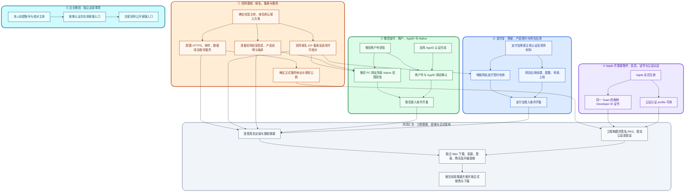

# AppSwitcher 对外发布：账号与资质办理操作单

核对日期：2026-09-28。适用范围：中国大陆个体工商户经营、官网注册登录及微信/支付宝收款、从官网下载并安装 **macOS** 版 AppSwitcher（首发 macOS 15+、Apple Silicon）。这里的桌面软件是 macOS 版，不是 iOS 版。各平台后台的菜单、材料和最终准入以实际账户页面与审核结果为准；本单记录办理路径，不表示已经获批。

## 我的办理清单：从现在开始逐项完成

**2026-09-28 本人反馈：个体工商户注册及营业执照申请正在进行，预计 2026-09-29 完成；尚未确认领照。** 下列“开户”均指取得个体工商户主体和营业执照，不指银行对公账户开户。结算账户类型另按支付平台要求核实。

使用方法：完成一条就把 `- [ ]` 改为 `- [x]`，也可以给该条文字加删除线。**提交申请和审核通过分别打勾**，不要一起勾选。等待或补材料时，在该条末尾写 `等待审核 / 待补材料：……`；只记状态、日期与不敏感的提示，不在本文保存证件、银行卡、密码、验证码或密钥。下面是执行清单，后面的依赖图和第 0—4 节保留详细解释。

### 最新进度：已有阿里云账号与服务器（2026-09-29）

证据：本人说明“已有个人阿里云账号，并开通服务器资源”，同时提供轻量应用服务器控制台截图。下面是**截图时点的资源状态**，不是远程登录、连通性或应用部署验收。

| 项目 | 已确认情况 | 尚待核验 |
| --- | --- | --- |
| 阿里云账号 | 本人反馈已有个人账号；截图显示已登录主账号控制台 | 账户实名认证具体状态、当前账号是否已有其他备案主体，以及能否用于本次个体工商户备案 |
| 云产品/地域 | 阿里云轻量应用服务器；华北 2（北京），共显示 1 台 | 该实例是否可供 AppSwitcher 使用、有无其他业务占用 |
| 实例与运行状态 | `Ubuntu-wzwq`；控制台显示“运行中” | SSH/系统健康、实际负载、磁盘余量及工程部署权限 |
| 系统与配置 | Ubuntu 24.04；2 vCPU、4 GiB 内存、50 GiB ESSD 云盘；已分配公网 IP | 带宽/流量套餐、CPU 架构、数据库/备份方案及生产配置适配 |
| 到期时间 | 截图显示 2027-05-24 23:59:59 | 订单购买/续费时长、备案资源校验及续费安排 |

为避免重复采购，**先核验这台现有资源，不再把“购买新服务器”当作必做步骤**。本次不将截图中的公网/私网 IP、实例 ID 或账号名复制到办理文档；工程实际接入时再受控交接。

- [x] **已有本人阿里云账号并能登录云控制台。** 依据：本人说明及截图；不等于域名持有人实名、备案主体或企业认证完成。
- [x] **已有北京地域轻量应用服务器资源。** 依据：截图中实例运行中；不等于已部署 AppSwitcher。
- [ ] **确认现有实例可用于本次备案。** 用购买服务器的同一账号进入[阿里云备案入口](https://beian.aliyun.com/)，检查已有备案主体及可用接入资源；以系统是否识别该实例并接受本次主体为准。截图到期日不能替代订单和备案资格核验。
- [ ] **确认现有实例适合承载本项目。** 先检查现有用途、架构、套餐、负载与可用空间，再由工程安排部署、数据库、备份及恢复验证；本轮尚未执行任何服务器操作。

官方参考：阿里云轻量应用服务器的备案服务号要求购买时长至少 3 个月（含续费）；同账号备案通常可直接选符合条件的资源，无需手动申请服务码。一个账号只能备案一个主体，个人认证账号（含个体工商户）不能按企业账号方式授权其他账号备案。因此**先核对现有账号的备案主体和本次个体户办理路径，不先新建账号、变更实名或重复购买**。[轻量服务器备案要求](https://help.aliyun.com/zh/simple-application-server/support/faq)、[备案账号与资源规则](https://help.aliyun.com/zh/icp-filing/basic-icp-service/support/for-the-record-process-faq)

对应步骤：W1 的“账号注册/登录”部分已完成，域名控制台及实名仍待确认；B2 部分完成；B3 的“云资源开通”部分已完成，备案资格和部署适配尚未完成，故 B2/B3 整项暂不打勾。B4/B5 备案、B7 邮件及 E1 生产基础验收均不据此提前完成。

### 当前办理路线：官网 ICP 是双渠道收款的共同前置（2026-09-29）

本项目采用「官网销售 + 微信 Native（PC 网站场景）+ 支付宝电脑网站支付」。**按这条路线，优先完成官网 ICP 备案；不为省去备案而另购新加坡服务器。** 境外节点可以满足先上线展示网站的需求，但不能替代支付产品申请所要求的备案材料。

- **微信：** 本次重新核对的[官方 Native 权限申请指引](https://pay.wechatpay.cn/doc/v3/merchant/4012791875)明确要求 PC 网站域名具有 ICP 备案；主体不一致时另有网站授权函要求。
- **支付宝：** 本人反馈已查看申请要求，同样依赖官网备案。本单据此将备案列为电脑网站支付申请的前置材料；本次未能独立读取当前账户的完整准入页面，具体主体匹配、授权及补件要求以本人[商家中心](https://b.alipay.com/signing/home.htm)实际申请页为准。此结论不外推到所有支付宝产品或仅注册商家账户的步骤。
- **部署安排：** 先核验现有北京服务器的备案资格与部署适配（B3），再按 I1—I12 完成域名、备案与上线。现有资源若不满足要求，再讨论调整，不提前重复购买。
- **主线顺序：** 证照及域名实名、接入资源齐备 → ICP 备案通过 → 官网经营内容可访问 → 两家网站支付申请/审核 → 工程交易联调。备案通过不等于支付已获批。
- **可以并行：** Apple 会员及证书、微信 AppID 准备、支付宝商家认证、官网本地制作、产品说明和客服材料；这些准备不必全部等备案结束。

### 并行候选：闲鱼平台成交与 Mac 软件交付（2026-09-29）

本人提出：官网 ICP 和自建支付继续办理，同时核实通过闲鱼出售自研软件的路径。**本节记录候选方案，不表示闲鱼已允许该商品上架、收款已开通或软件已具备此交付能力；原官网双渠道方案继续推进。**

**依赖关系：** Apple 付费会员 → Developer ID 签名、公证及独立 Mac 验收；闲鱼账号/商品类目准入 → 平台收款及交付规则确认；软件授权方案 → 实现及验收。三项齐备后才可开始真实销售。官网 ICP、官网微信/支付宝接口申请是另一条并行线。

平台内成交可以减少自行接入微信 Native、支付宝电脑网站支付的依赖，但不是完全不使用支付机构。闲鱼[用户服务协议](https://terms.alicdn.com/legal-agreement/terms/suit_bu1_other/suit_bu1_other201708081618_51146.html)要求卖家签署相应支付服务协议；[支付宝绑定及授权协议](https://terms.alicdn.com/legal-agreement/terms/suit_bu1_taobao/suit_bu1_taobao202111171546_51269.html)也说明卖家需开通相应收款服务。具体以当前账号提示为准，不能将普通个人转账与平台订单结算混为一谈。

- [ ] **X1｜确认闲鱼准入。** 在闲鱼 App 的发布类目、规则中心或官方客服处，按真实商品描述询问“自行开发的 macOS 工具软件使用授权，电子交付，非他人账号或破解软件”是否允许销售；核对个人/经营者身份、证明材料、交付方式及退款规则。**完成标志：** 留存实际适用规则或客服答复，确认可用类目及账号资格；看到其他卖家在售不算确认。**操作估算：** 20—40 分钟；回复/审核周期未核实。
- [ ] **X2｜核实平台收款与费用。** 按闲鱼实际要求完成认证及收款服务开通，查看平台订单结算、提现、服务费及可能的保证金要求。**完成标志：** 当前账号可按平台规则收款，费用和结算时点已记录；不以站外转账替代此项。**操作估算：** 15—30 分钟；审核、费用及到账周期以账号页面为准，本单未核实具体费率。
- [ ] **X3｜完成 Apple 站外分发准备。** 复用 A1—A4、D1—D4；需 Apple Developer Program 付费会员，不只是免费开发者账号。App 用 Developer ID Application 签名，PKG 另用 Developer ID Installer 签名，提交实际制品公证并附加票据；在另一台正常启用系统安全检查的 Mac 验证安装、首次启动及辅助功能授权。**完成标志：** 实际交付包通过上述检查；不等于会员申请通过就已经可交付。**耗时：** 复用 Apple 与正式制品检查的原排期，不重复计算。[Apple 站外分发](https://developer.apple.com/developer-id/)
- [ ] **X4｜确定并实现不依赖未就绪官网的授权交付。** 当前商业方案依赖官网登录及在线授权刷新，本地离线凭证最长 7 天；后台权益只读管理也不是现成的闲鱼人工发货功能。因此仅更换收款渠道不能解除在线服务依赖。候选是新增人工签发、客户端本地验签的授权文件，或明确另一个独立交付版本；需先确定销售期限、续期、退款及将来迁回官网的衔接，再修改 spec、实现并测试。**完成标志：** 买家无需访问未备案的北京服务即可完成约定的安装、激活和使用；重装/到期等行为符合售卖说明。本条尚未实现，不能使用开发模拟付款给真实买家开通。**方案梳理估算：** 30—60 分钟；开发工期需选定方案后另估，不沿用现成官网接入工期。[当前商业规格](../features/FEAT-002-commercialization/spec.md)、[现有服务说明](../../web/README.md)
- [ ] **X5｜验证交付闭环后再上架。** X1—X4 齐备后，准备如实说明兼容系统/芯片、功能、授权期限、交付步骤、售后与更新范围的商品草稿；以平台允许的方式交付签名公证安装包及授权，记录订单与授权对应关系，核实退款时如何处理授权。**完成标志：** 独立 Mac 交付演练通过，买家不被未就绪的登录/支付入口卡住，再由本人发布。**操作估算：** 草稿 30—60 分钟，独立 Mac 演练 30—60 分钟；平台审核时间未知。

**本轮核验边界：** Apple 站外分发及闲鱼平台收款框架有上述官方依据；未找到足以确认本账号可售 AppSwitcher 的官方类目准入结论，X1 仍待核实。没有发布商品、购买会员、收款或修改授权代码。若继续使用中国内地的自建网站/API，仍须核实并满足该服务自身的备案要求，闲鱼成交不能替代。

### 怎么看耗时、怎么排日程

以下时间于 **2026-09-28** 补充。**“本人/工程操作”是需要投入的时间，“审核/等待”是日历上经过的时间；两者不能混为一谈。** 所有主动操作耗时及标明“估算/缓冲”的等待值均为本项目排期估算，假设材料齐全、账号正常、有人及时配合，不是平台审批承诺，也不代表已实际测量。

- 等待周期从**对应前置条件齐备、有效申请提交后**起算；补件、驳回重提、额外许可和无人配合可能延长。
- 工作日不等于自然日，临近节假日应额外留缓冲，本文不据此推算固定获批日期。
- 并行事项取最长的一条线，不把所有数字相加；A7/B2、B8/C1、B9/C2、C8/C9 是同一流程的不同阶段，避免重复计算。
- **今天先安排约 1.5—3 小时**用于 Apple 申请、域名候选及备案咨询；Apple 等审核时继续官网准备。
- **拿照后先安排半天至一天**核对主体资料、完成域名/云认证与申请材料；能否当天提交备案取决于域名信息同步和接入条件。
- **整体首发暂留约 4—8 周的排期窗口**，从证照可用、域名/云方案开始落实时起算，假设四条线并行、无额外许可或重大返工。这是安排精力的粗估，不是上线承诺；取得备案和各平台实际受理时间后再收窄。最需提前启动的是域名实名/备案与各项账号审核。

#### 耗时依据与口径

| 编号 | 本次可核对的依据 | 如何使用 |
| --- | --- | --- |
| T1 | [Apple 会员确认指引](https://developer.apple.com/help/account/membership/program-enrollment/)：购买后 24 小时未收到会员确认可联系支持 | 是跟进节点，不是从首次申请起算的审核保证 |
| T2 | [阿里云备案流程 FAQ](https://help.aliyun.com/zh/icp-filing/basic-icp-service/support/for-the-record-process-faq)：域名实名、修改/过户后的信息同步约需三天 | 实际注册商和备案系统可能有不同处理路径；以能否受理为准 |
| T3 | [阿里云备案进度说明](https://help.aliyun.com/zh/icp-filing/the-progress-of-inquires-1)：初审 1—2 个工作日，提交管局后一般 1—20 个工作日 | 仅作为采用该接入商时的参考；不包含本人材料准备、退回补件及额外许可 |
| T4 | [微信 PC 网站接入指引](https://pay.wechatpay.cn/static/applyment_guide/applyment_detail_website.shtml)：审核 1—2 个工作日 | 仅用于网站商户入驻参考；不外推为 AppID 认证或新增 Native 权限的时限，实际以申请单为准 |
| T5 | [支付宝网页应用流程](https://open.alipay.com/module/webApp)、[商家产品入口](https://b.alipay.com/signing/home.htm) | 本次未核实适用于当前主体的统一审核周期，因此相关天数仅为排期缓冲；不使用其他支付宝产品的审核时限替代 |

办理时可在每条后补记：`提交：____；后台预计：____；实际完成：____`。平台给出本申请的具体时限后，优先用该时限替换下方估算。

### 一、注册 Apple 开发者账号

**办理范围：** 个人会员申请、付款、生效，以及后续签名证书和公证认证。此组无需等待官网域名、备案或营业执照。保留原编号 A1—A4、D1—D4，已有完成备注原样保留。

#### 1. 申请会员（A1—A4）

- [✅ ] **A1｜准备 Apple 注册设备与账户。** 选择一台在整个注册期间持续使用的 iPhone、iPad 或符合要求的 Mac；登录 iCloud，确认申请用的本人 Apple 账户已开启双重认证、姓名与联系方式真实有效。安装或更新 Apple Developer App。**完成标志：** 能在该设备打开 App 并登录本人账户。[官方准备要求](https://developer.apple.com/cn/help/account/membership/enrolling-in-the-app)

  **耗时：** 本人 15—30 分钟；账户恢复、双重认证异常另计。
——以上已完成！

- [ ✅] **A2｜开始 Apple 个人会员申请。** Apple Developer App →「账户」→ 登录 →「现在注册」→「继续」。按提示输入本人法定姓名、身份及联系方式，完成自拍验证；需要英文姓名、地址时按页面填写，实体类型选「个人」。**完成标志：** 个人信息及身份验证步骤已提交；若显示待审核，记下状态即可，不必等它结束再推进官网准备。[官方注册步骤](https://developer.apple.com/cn/help/account/membership/enrolling-in-the-app)

  **耗时：** 本人 20—40 分钟；身份审核暂留 1—5 个工作日缓冲（估算，非官方时限），补材料可能更久。
——以上已完成！

- [ 待付费] **A3｜完成会员协议与购买。** 当 App 允许继续时，阅读并接受会员协议，核对年度费用、自动续期及付款方式，由本人完成付款。官方页面本次核对显示每年 ¥688，实际以付款页为准。**完成标志：** 已完成购买并保留官方收据；待激活不等于会员已有效。[官方购买说明](https://developer.apple.com/cn/help/account/membership/enrolling-in-the-app)
——暂未付费购买。
  **耗时：** 本人 5—10 分钟；等待 A2 允许购买的时间不重复计算。

- [ 待处理] **A4｜确认会员生效。** 登录 [Apple 开发者账户](https://developer.apple.com/account/)，核对会员有效，账户持有人能进入 Certificates, Identifiers & Profiles，并能找到 Team ID。**完成标志：** 会员及证书页面可用。若本来已有有效会员，直接核验这一条，A2/A3 标注“已有会员，无需重复办理”。

  **耗时：** 本人核验 5—10 分钟；付款后等待激活。Apple 指引是购买后 24 小时未收到会员确认可联系支持，**不是承诺整套申请 24 小时完成**。[时限依据 T1](#耗时依据与口径)

#### 2. 会员生效后：证书与公证认证（D1—D4）

在将来正式构建的 Mac 上与工程配合：本人负责官方账户操作，工程负责本机检查和工具配置。无需等待官网或支付全部办完。

- [ 待处理] **D1｜确定构建 Mac 并生成 CSR。** 在该 Mac 的“钥匙串访问 → 证书助理 → 从证书颁发机构请求证书”生成请求文件，按第 2 节操作。**完成标志：** CSR 可供官方证书申请使用，对应私钥保留在本机。[Apple CSR 指南](https://developer.apple.com/help/account/certificates/create-a-certificate-signing-request)

  **耗时：** 本人及工程 10—20 分钟；通常无需另等人工审核，异常另计（估算）。

- [ ] **D2｜申请并安装 Developer ID Application。** 以 Account Holder 打开 [证书页面](https://developer.apple.com/account/resources/certificates/list)，新增对应类型，上传 CSR，下载证书并装回原 Mac。**完成标志：** 工程确认 App 签名身份有效且带可用私钥。

  **耗时：** 本人及工程 15—30 分钟；前提已具备且平台正常时按同一操作时段完成排期（估算）。

- [ ] **D3｜申请并安装 Developer ID Installer。** 同一 Team 下按对应类型申请，必要时重新生成 CSR，装回构建 Mac。**完成标志：** 工程确认 PKG 签名身份有效且带可用私钥。不是第二份付费会员。[两种证书说明](https://developer.apple.com/help/account/certificates/create-developer-id-certificates)

  **耗时：** 本人及工程 15—30 分钟；前提已具备且平台正常时按同一操作时段完成排期（估算）。

- [ ] **D4｜配置并验证公证认证。** 按第 2 节及[现有公证交接说明](owner-account-setup.md)，本人在构建 Mac 的官方工具提示中输入认证材料，保存 Keychain profile。**完成标志：** 工程确认认证验证通过，只记录 profile 名称；具体安装包公证留待 E3。

  **耗时：** 本人及工程 15—30 分钟；认证异常、账户安全设置问题另计（估算）；不含安装包公证。

### 二、注册官网域名与办理官网基础

**办理范围：** 域名注册、云接入、备案、网站内容和邮箱。此组不需要 Apple 账号，也不必等待 Apple 会员申请结果。保留原编号 A5—A7、B1—B7。

#### 1. 可先开始：域名与备案方案（A5—A7）

- [ ] **A5｜选好官网域名。** 在拟用的正规域名注册商查询候选域名，确认可注册、首年与续费价格；记录最终候选。域名无需和 Apple 个人会员姓名相同。**完成标志：** 已选定可注册的域名及注册商。[域名注册流程参考](https://help.aliyun.com/zh/dws/getting-started/quickly-register-a-new-domain-name)

  **耗时：** 本人 30—60 分钟；取名与比较耗时另计，无审批等待。

- [ ] **A6｜先确认备案方案和域名持有人要求。** 向拟用云服务商备案支持核实：拟注册主体所在省份、个体工商户网站、销售自有 macOS 软件，分别需要什么主体材料；域名能否登记在经营者本人名下；哪些云资源符合备案条件；实际业务有无额外许可要求。**完成标志：** 已获得适用于本主体的材料清单、域名实名要求及可备案资源方案。阿里云资料仅作为流程参考，不表示已替你选定供应商。[备案准备参考](https://help.aliyun.com/zh/icp-filing/basic-icp-service/user-guide/overview)

  **耗时：** 本人咨询 30—60 分钟；预留 1—3 个工作日取得答复（估算）；涉及额外许可时另行排期。

- [ ] **A7｜注册域名，或等营业执照到手后实名注册。** 若 A6 已确认接受当前持有人资料，可现在注册并实名认证；若要以执照主体登记，实际拿照后再办理。尚未确认主体匹配规则时，建议先保留候选，拿照后按正确资料注册，避免过户返工。**完成标志：** 域名在本人控制的账户下且实名通过；仅选好名称暂不勾选。[域名实名认证说明](https://help.aliyun.com/zh/dws/user-guide/how-to-complete-domain-name-authentication)

  **耗时：** 本人 15—30 分钟；采用下方阿里云示例时，官方实名审核参考通常 1 个工作日、部分 3—5 个工作日；用于备案的信息同步另见 B2。

#### 域名实操：按你此前的候选逐个查询、选择和注册

2026-09-29 补充。候选来自此前的域名方案（本机来源：`/Users/eeo/Documents/ai-projects/Action&Projects/make-A-company/个体户名称与经营范围.md`），其中查询日期是 **2026-09-15**。它记录的是早期 Flint 品牌方案；2026-09-28 注册过程总结（本机来源：`/Users/eeo/Documents/ai-projects/Action&Projects/make-A-company/docs/个体工商户注册过程总结-2026-09-28.md`）明确说明英文品牌、域名尚未完成新的确认或注册。因此这里沿用候选供你办理，**不把旧“可注册”结论当作今天仍可买，也不把候选当作已经购买或最终定名**。本次没有登录注册商查询结账价格或下单。

| 此前候选 | 原定用途 | 本次办理顺序建议 |
| --- | --- | --- |
| `flintlabs.cn` | 国内后缀、备案保护 | 优先查询，若可注册且备案检查通过，建议作为当前大陆官网主域名候选，不只作为保护域名 |
| `flintlabs.io` | 品牌主域名 | 保留为品牌候选；先检查是否支持拟用接入商的大陆备案，不能仅凭“可注册”确定为当前支付官网 |
| `hiflint.ai` | 产品域名 | 保留为独立产品/品牌候选；阿里云当前说明 `.ai` 不能直接办理中国内地 ICP 备案，不作为本次大陆支付官网的默认选择 |
| `flintlabs.net`、`flintlabs.tech` | 备选 | 若 `.cn` 不可注册，逐个查注册状态、续费及备案适用性后再选 |
| `joinflint.ai`、`flint-ai.ai` | 备选 | 同样先核对 `.ai` 的备案限制；不因首选被占就直接购买 |
| `flintlabs.app`、`flintlabs.dev` | 旧查询未明确 | 先查当前可注册状态，再核对备案适用性，不作为已确认可用候选 |

以上优先级是根据当前大陆收款官网需求提出的**新建议，尚未替你选定或购买**。旧方案中 `flint.ai`、`flintlabs.ai`、`flintlabs.com`、`getflint.ai` 等曾记录为已注册；若想重新考虑，也以注册商当前状态为准，不据旧记录断言永久买不到。旧价格估算不沿用。

**先解决一个能用于当前官网的域名，再决定是否额外购买品牌保护域名。** `.cn` 完成备案不能替 `.ai` 或 `.io` 获得备案；同一网站的支付资料必须对应实际经营域名。[阿里云关于 `.ai` 的说明](https://help.aliyun.com/zh/document_detail/3043828.html)、[备案域名核验要求](https://help.aliyun.com/zh/icp-filing/basic-icp-service/user-guide/prepare-and-check-the-domain-name)

下面采用**阿里云中国站/万网作为具体操作示例**，方便你照做；这不表示你已经选定供应商。若已有腾讯云等账户，可以在相应平台注册，付款前仍须核对备案接入条件。以下 W1—W9 是 A5—A7/B2 的细化，耗时不与原步骤重复相加。

- [ ] **W1｜使用已有阿里云账号进入域名控制台。** 2026-09-29 已确认本人有个人账号并可登录云控制台，无需重复注册；继续使用该账号，核对账户实名认证并进入域名控制台。**完成标志：** 能进入域名控制台；不要误用国际站作为大陆备案注册路径。**操作估算：** 10—20 分钟，账户审核另计。
- [ ] **W2｜逐个查询候选。** 打开[万网域名查询](https://wanwang.aliyun.com/)，先输入 `flintlabs.tech`、`flintlabs.cn`；`.io`、`.ai` 若万网不支持则跳过，不作为本次大陆备案的默认候选。输入域名本身，不带 `https://`、路径或 `www`。**完成标志：** 在下方表格记下查询日期、可注册/已注册/溢价/不支持状态及报价。**操作估算：** 15—30 分钟。未找到网站、DNS 无记录或 WHOIS 无结果，都不等于可注册；“一口价/交易”属于已注册域名的购买，不是普通新注册。
- [ ] **W3｜付款前检查备案可用性。** 进入[阿里云备案入口](https://beian.aliyun.com/)，使用域名备案检测入口或联系备案支持，逐项核实后缀、注册商、持有人和拟用接入资源。可直接询问：“我拟以北京个体工商户经营主体，为自有 macOS 软件官网备案，候选是 flintlabs.cn、flintlabs.io、hiflint.ai；哪个能备案？域名应按营业执照主体还是经营者本人实名？” **完成标志：** 明确选定域名可以用于本次备案，或记录不可用原因并换候选。**操作估算：** 20—40 分钟；答复等待沿用 A6。
- [ ] **W4｜确定买哪个、买几个。** 根据 W2/W3 选择本次官网主域名；其余候选仅在你确实需要且接受续费成本时另买。**完成标志：** 写下最终主域名及可选保护域名；若 `.cn` 不可注册，先比较 `.net/.tech` 等备选，不自动进入高价收购。**操作估算：** 10—20 分钟。
- [ ] **W5｜创建域名持有人信息模板并实名。** 在[域名控制台](https://dc.console.aliyun.com/)进入信息模板相关入口，新建模板，按 W3 确认的主体类型填写。使用营业执照时，名称逐字照执照，不填 Flint Labs 或旧拟用工商名称；联系方式填本人能持续接收通知的邮箱和手机号，完成邮箱验证并提交平台要求的证件。**完成标志：** 模板实名审核通过。**操作估算：** 20—30 分钟；官方参考通常 1 个工作日，部分 3—5 个工作日。账户实名认证与域名持有人实名是两层：个人认证云账户也可使用企业类型模板，域名归属取决于选中的持有人模板。[实名材料与填写说明](https://help.aliyun.com/zh/dws/user-guide/how-to-complete-domain-name-authentication)
- [ ] **W6｜核对订单并由本人付款。** 回到查询结果，选择目标域名的注册入口，选择注册年限及已通过实名的模板。逐项检查完整拼写、持有人、是否普通注册、最低注册年限、首期总价、续费单价及附加服务；若某后缀要求多年起购，比较总价。核对自动续费设置和服务条款后再付款。**完成标志：** 付款订单与自己确定的域名、主体一致。**操作估算：** 10—15 分钟。[官方注册流程](https://help.aliyun.com/zh/dws/getting-started/quickly-register-a-new-domain-name)
- [ ] **W7｜确认域名真正注册成功。** 在域名控制台的域名列表查看完整域名、持有人、注册状态和到期日期；若仍是注册局审核中，按提示等待，不以扣款成功代替注册成功。**完成标志：** 域名在本人控制账户中，状态正常、实名通过；保存订单和到期信息。**操作估算：** 5—10 分钟；审核通常 1 个工作日，部分 3—5 个工作日，同一次模板/域名审核不机械重复累加。[官方状态说明](https://help.aliyun.com/zh/dws/getting-started/quickly-register-a-new-domain-name)
- [ ] **W8｜确认续费并交接公开信息。** 检查续费通知邮箱、自动续费选择及支付条件；只向工程提供域名、注册商、实名状态、备案检测结果，不发送账户密码或证件。**完成标志：** 本人可持续管理域名，工程知道后续备案和 DNS 在哪里配置。**操作估算：** 10 分钟。
- [ ] **W9｜衔接备案和网站配置。** 按 B2—B5 办理备案；实名同步时间按实际备案系统提示。由工程规划 DNS、HTTPS、邮件和下载入口；品牌域名若用于多个产品，可讨论使用主域名下的产品路径或子域名，**子域名不用另买一个注册域名**。例如仅在选定并持有 `flintlabs.cn` 后，可考虑 `appswitcher.flintlabs.cn`，具体地址尚未定稿。**完成标志：** 官网主地址与备案、支付材料一致，后续按 E1 验收；此条不是付款后即已上线。**操作估算：** 交接 15—30 分钟，工程和备案等待沿用 B/E 组，不再重复计时。

查询与决策记录（只填公开信息）：

| 域名 | 查询日期 | 注册商显示状态 | 首期总价/年限 | 续费单价/年 | 备案检查结果 | 本次是否购买 |
| --- | --- | --- | --- | --- | --- | --- |
| `flintlabs.tech` | 待填 | 未实时核验 | 待填 | 待填 | 后缀在阿里云公开列表中；具体域名/主体待校验 | 待决定 |
| `flintlabs.cn` | 待填 | 未实时核验 | 待填 | 待填 | 待核验 | 待决定 |
| `flintlabs.io` | 待填 | 未实时核验 | 待填 | 待填 | 待核验 | 待决定 |
| `hiflint.ai` | 待填 | 未实时核验 | 待填 | 待填 | 当前官方说明不支持直接大陆备案 | 待决定 |
| 其他备选：____ | 待填 | 未实时核验 | 待填 | 待填 | 待核验 | 待决定 |

#### 2. 营业执照到手后：实名、云资源与备案（B1—B5）

以实际领照为准；2026-09-29 是此前预计日期，不自动视为已经完成。

- [ ] **B1｜核对并保存营业执照。** 确认已实际获照，核对主体名称、统一社会信用代码、经营者与经营范围，将原件/电子件保存在自己的安全位置。**完成标志：** 正式证照可用于平台验证。尚未实际领照时不提前勾选。

  **耗时：** 本人核对 10—20 分钟；领照时间按你预期为 2026-09-29，属于本人提供的预计日期，不是已获批或官方承诺。

- [ ] **B2｜完成域名和云账户的主体资料。** 2026-09-29 已确认存在个人阿里云账号；尚未核验实名详情及本次备案主体适用性。按 A6 核实的规则完成域名实名、所需云账户资料；如果 A7 已办好且符合规则，无需重买域名。**完成标志：** 拟备案主体与域名资料满足接入商要求，实名信息已可用于备案。

  **耗时：** 本人 20—40 分钟；域名新认证按下方 W5/W7 的官方周期参考，云账户认证以后台为准；另为域名实名信息同步留约 3 个自然日，实际以备案系统可受理状态为准。与 A7 是同一认证时不要重复累加。[时限依据 T2](#耗时依据与口径)

- [ ] **B3｜核验已有云资源的备案资格与部署适配。** 2026-09-29 截图已确认北京地域 `Ubuntu-wzwq` 轻量应用服务器运行中（Ubuntu 24.04、2 vCPU/4 GiB/50 GiB ESSD）；资源开通部分已完成。先用现有账号在备案系统检查实例资格、购买时长与主体条件，再核对服务器已有用途和工程配置。仅在现有资源确实不满足要求后再讨论调整或新购。**完成标志：** 备案系统认可该接入资源，工程确认可用于本项目部署；目前整项仍待完成。

  **剩余耗时估算：** 本人及工程初步核验 30—60 分钟；需要客服核实账号/主体规则时另留 1—3 个工作日缓冲，不再计入新购服务器时间。

- [ ] **B4｜提交 ICP 备案申请。** 在实际接入商的备案系统发起申请，按要求填写个体工商户主体、网站、域名、负责人及接入资源，完成本人真实性核验/短信核验等步骤。**完成标志：** 系统显示申请已提交，记录日期及当前环节。具体操作见下方 I6—I10。[备案流程参考](https://help.aliyun.com/zh/icp-filing/basic-icp-service/support/for-the-record-process-faq)

  **耗时：** 本人 45—90 分钟；本条止于提交，后续初审和管局审核统一计入 B5。

- [ ] **B5｜跟进备案审核至通过。** 根据接入商和主管部门提示补材料，确认批准结果及备案号，并把号交工程用于官网展示；A6 若确认有其他适用许可，也须落实。**完成标志：** 备案已通过，适用许可条件已核实，不能用接入商初审通过代替最终通过。

  **耗时：** 本人每次跟进 5—15 分钟；参考阿里云初审 1—2 个工作日、提交管局后一般 1—20 个工作日。整段排期暂留 2—5 周，节假日与补材料另加；其他许可办理不包含在内。[时限依据 T3](#耗时依据与口径)

#### ICP 实操：可备案域名 → 现有北京服务器 → 正式提交（I1—I12）

2026-09-29 补充。**本流程按继续使用已有阿里云北京轻量应用服务器来写。** 国外注册域名不会让北京服务器免备案；如果以后改用香港/海外节点，应另行调整部署及支付方案。下面细化 W2—W9、B2—B5，不重复计算耗时，也不改变已完成事项。

**当前起点：** 已有阿里云账号及服务器；最终域名、备案主体校验、服务器备案资格尚未确认。你新考虑的 `flintlabs.tech` 可以加入候选：阿里云公开的备案域名后缀列表包含 `.tech`，但这只确认后缀层面的条件，**不代表该具体域名仍可注册或申请一定通过**。[域名核验要求与后缀列表](https://help.aliyun.com/zh/icp-filing/basic-icp-service/user-guide/prepare-and-check-the-domain-name)

**操作路线：** 域名可注册查询 → 后缀/注册商检查 → 主体规则确认 → 注册并实名 → 同账号核验服务器 → 填表与上传 → 提交初审 → 短信核验 → 管局通过 → 官网标识与上线。

- [ ] **I1｜查询拟用主域名是否可买。** 打开[万网](https://wanwang.aliyun.com/)，分别输入 `flintlabs.tech`、`flintlabs.cn`；核对完整拼写、普通注册或溢价/交易状态、首期总价及续费价格。若页面不支持某后缀，不等于已被注册。**完成标志：** 确定一个价格可接受的待注册域名，记录查询日期。**操作估算：** 10—20 分钟；本次仍未代你实时查询或购买。
- [ ] **I2｜付款前查后缀与注册商是否满足备案条件。** 在[工信部域名行业管理系统](https://domain.miit.gov.cn/)核对域名后缀及注册服务机构的审批信息，或使用[阿里云备案入口](https://beian.aliyun.com/)的检测/官方咨询。已有域名可用[WHOIS 查询](https://whois.aliyun.com/)核对实际注册商。**完成标志：** 后缀和拟用注册商均满足要求；若境外注册商未获批复，先确认可否转入及转移限制，不先付款再假设能备案。**操作估算：** 15—30 分钟。未购买时出现“未注册/未实名”只说明还缺后续步骤，不等于后缀不支持。[核验规则](https://help.aliyun.com/zh/icp-filing/basic-icp-service/user-guide/prepare-and-check-the-domain-name)
- [ ] **I3｜明确本次个体工商户的主体填写方式。** 登录购买服务器的同一个阿里云账号，进入备案系统查看是否已有备案主体。向备案支持说明“现有个人阿里云账号和北京轻量服务器，拟以营业执照上的个体工商户办理自有软件官网备案”，确认账号可否沿用、备案性质/证件类型及域名持有人模板要求。**完成标志：** 确定正确主体路径；不用个人云账号这一事实推断网站必须做个人备案，不拿 Flint Labs 代替证照全称。若已有其他主体，不自行注销或覆盖原备案。**操作估算：** 20—40 分钟；客服等待沿用 A6。[账号与资源检查](https://help.aliyun.com/zh/icp-filing/basic-icp-service/user-guide/icp-filing-server-access-information-check)
- [ ] **I4｜完成购买、实名和信息同步。** 按 W5—W7 创建符合 I3 的实名模板，使用最终证照资料注册域名，确认域名出现在本人账户且状态正常。将域名实名的名称、证件类型/号码与备案拟填资料逐项对照。**完成标志：** 域名实名通过，备案系统可校验；不是仅有支付成功记录。**操作估算：** 20—40 分钟；实名审核沿用 W5/W7。信息同步通常需 2—3 天；阿里云域名可能先收初审后延后提交管局，按系统提示操作，不机械重复等待。[官方同步说明](https://help.aliyun.com/zh/icp-filing/basic-icp-service/user-guide/prepare-and-check-the-domain-name)
- [ ] **I5｜核验并关联现有服务器。** 在[备案系统](https://beian.aliyun.com/)的资源校验或接入信息环节，选择账号内北京地域轻量实例 `Ubuntu-wzwq`。检查系统是否认定可用于备案，以及订单累计购买/续费时长是否满足要求。同账号通常无需另申请服务码；个人账号跨账号授权存在限制，不默认改走服务码。**完成标志：** 系统接受该实例作为接入资源。找不到时先查账号、资源产品与购买条件，不直接重买。**操作估算：** 10—20 分钟。[服务器检查](https://help.aliyun.com/zh/icp-filing/basic-icp-service/user-guide/icp-filing-server-access-information-check)
- [ ] **I6｜开始备案并完成基础信息校验。** 在备案首页点“开始备案”，选择自助办理；本次为**官网**选择“网站”服务类型，输入最终主域名，不带 `https://`、`www` 或路径。地区按备案主体实际所在地，不能按服务器地域随意选；备案性质、证件类型按 I3 确认结果，填写执照全称、证件号码和住所。系统根据已有记录识别首次备案/新增/接入等类型。**完成标志：** 信息校验通过、生成本次订单；这还不是正式提交。**操作估算：** 15—25 分钟。原生客户端是否另有适用备案要求不由本次“网站”勾选结果推定。[基础信息填写指引](https://help.aliyun.com/zh/icp-filing/basic-icp-service/user-guide/basic-information-check)
- [ ] **I7｜填写主办者、负责人和网站资料。** 按页面填写真实联系人、联系电话和邮箱；本人兼任相关负责人时按平台规则填写。网站名称可先拟“燧光知序软件官网”，以实际品牌及命名规则审核为准。网站内容如实说明自有 macOS 软件介绍、下载、账号服务、付费权益和售后，不为过审隐去收款业务。服务内容分类、是否前置审批或另需许可由实际业务与主管要求判断。**完成标志：** 字段和真实经营内容一致，接入资源为 I5 核验的实例。**操作估算：** 20—30 分钟。[网站信息指引](https://help.aliyun.com/zh/icp-filing/basic-icp-service/user-guide/fill-in-website-information)
- [ ] **I8｜上传材料、实人核验并最终提交。** 按本订单清单提供执照、负责人证件及适用的其他材料，在官方 App/页面完成人脸核验等操作，再逐页预览，勾选协议并提交。**目前只有电子营业执照时：先检查是否有官方电子证照授权/核验入口；若页面要求证件原件照片，向备案支持核实接受形式，必要时领取纸质版。不要把屏幕翻拍当作原件照片。** **完成标志：** 状态从草稿/未提交进入审核，记下提交日期。**操作估算：** 20—40 分钟，准备材料另计。[官方材料与真实性要求](https://help.aliyun.com/zh/icp-filing/basic-icp-service/user-guide/basic-information-check)
- [ ] **I9｜处理阿里云初审。** 在“我的备案”查看进行中订单，接听审核电话；有退回意见时只针对实际问题补正并重新提交，确认已重新进入审核。备案期间官网不在未备案的北京接入上公开运营，页面可以在本地继续准备。**完成标志：** 初审通过，订单进入提交管局/后续核验流程。**周期：** 阿里云官方参考 1—2 个工作日，补正另计；本人每次跟进约 5—15 分钟。[整体流程](https://help.aliyun.com/zh/icp-filing/basic-icp-service/user-guide/icp-filing-application-overview)
- [ ] **I10｜按通知完成工信部短信核验。** 收到通知后，由短信要求的负责人在[工信部 ICP 备案系统](https://beian.miit.gov.cn/)进入短信核验，按提示输入核验所需资料；在短信规定的有效期内完成。若主体和网站负责人均需核验，逐个完成；由本人输入验证码，不交工程代填。**完成标志：** 核验成功且订单状态已更新；只收到短信不算完成。**操作估算：** 每人 5—10 分钟；未收到、过期或号码错误时按官方提示处理。[短信核验指引](https://help.aliyun.com/zh/icp-filing/basic-icp-service/user-guide/sms-check)
- [ ] **I11｜等待管局审核并核对备案结果。** 关注备案系统、短信及邮件；退回时按原因补正，保留真实状态。通过后核对主体、域名及备案号，并在工信部系统查询对应记录。**完成标志：** 管局审核通过、取得与本次主体及网站一致的备案信息；不能用云初审通过代替。**周期：** 官方参考通常 1—20 个工作日，实际以管局为准；不能承诺加急或固定获批日。[审核流程](https://help.aliyun.com/zh/icp-filing/basic-icp-service/user-guide/icp-filing-application-overview)
- [ ] **I12｜交接上线及备案后维护。** 将最终域名、备案号和通过状态交工程，完成 DNS、HTTPS、首页底部备案号及工信部查询链接，验证实际访问；支付/正式下载仍须通过 E 组验收后开放。同时登记网站开通日期，按官方指引在开通后 30 天内完成公安联网备案，入口为[全国互联网安全管理服务平台](https://www.beian.gov.cn/)，要求及材料按所在地公安机关核实。**完成标志：** 网站备案展示正确、上线检查有记录，公安备案已跟进完成；ICP 与公安备案分别记录，不相互替代。**操作估算：** 工程交接/展示检查 30—60 分钟，部署时间沿用 E1；公安填报先留 30—60 分钟，审核时限另向受理部门确认。[备案后事项](https://help.aliyun.com/zh/icp-filing/basic-icp-service/user-guide/icp-filing-application-overview)

本阶段仅落实办理路径，未代为提交任何备案。自助申请与付费备案管家是不同服务；如出现付费套餐，先核对是否选中了可选增值服务。域名、云资源和可能适用的许可费用分别计算，不能因出现套餐就认定 ICP 备案本身必须购买代办。

进度记录：`主域名：____；注册商：____；实名通过日期：____；已有账号主体核验：____；北京实例备案校验：____；提交初审：____；短信核验：____；管局结果/备案号：____；官网开通日期：____；公安备案状态：____`。只填公开标识和状态，证件号码及验证码不记入本文。

#### 3. 与备案并行：官网内容和邮箱（B6—B7）

- [ ] **B6｜确认官网展示材料。** 准备可公开的经营主体名称、产品用途与价格、客服联系方式；核对工程提供的隐私、用户服务及退款条款。**完成标志：** 对外展示内容真实、可用且经本人确认。页面制作可以在备案期间进行。

  **耗时：** 本人核对 1—2 小时；工程整理页面与条款预留 0.5—2 个工作日（估算），产品方案重新调整另计。

- [ ] **B7｜确定客服邮箱与事务邮件服务。** 选择本人可管理的客服邮箱和发送登录验证码的邮件服务，按服务商流程完成发件域验证；DNS 和接入配置交工程协助。**完成标志：** 客服可收信，工程实测验证码能送达外部测试邮箱。仅注册一个邮箱不等于验证码服务就绪。

  **耗时：** 本人及工程 1—2 小时；域验证、DNS 生效及供应商审核暂留 1—3 个工作日（估算）。

### 三、微信与支付宝商户及支付申请

这组使用经营主体及相应官网材料，与 Apple 开发者账号申请分开。微信与支付宝互不等待；备案或审核等待期间可先准备材料，具体提交条件以后台为准。

#### 1. 商户基础资料（B8—B10）

- [ ] **B8｜提交微信商户入驻或核验已有商户。** 打开 [微信支付商户平台](https://pay.weixin.qq.com/)，按真实个体工商户资料办理，准备平台要求的经营者、结算及客服信息。申请所需官网材料未齐时记录缺口；若入驻时能一并申请 Native，则无需日后重复申请。**完成标志：** 已提交入驻，或已有商户号确认可以复用；审批结果另见 C1。[申请指引](https://pay.wechatpay.cn/doc/v3/merchant/4012791875)

  **耗时：** 本人 30—60 分钟；本条止于提交，审核等待计入 C1；备案等材料未齐的等待不计入审核时间。

- [ ] **B9｜确定微信 AppID 来源并申请认证。** 先核对已有服务号/小程序是否适用；没有时，在 [微信公众平台](https://mp.weixin.qq.com/)按本主体可申请的账号类型办理并认证。先确认适用性、认证条件和费用，再新建账号；不要把 macOS App 当作微信移动应用申请。**完成标志：** 已选定可用于 Native 的 AppID 来源并提交所需认证；获批另见 C2。[Native 接入准备](https://pay.wechatpay.cn/doc/v3/merchant/4015614538)

  **耗时：** 本人 30—90 分钟；本条止于申请，认证等待计入 C2；已有可用认证账号可缩短。

- [ ] **B10｜办理支付宝商家主体认证。** 打开 [支付宝商家中心](https://b.alipay.com/signing/home.htm)，使用本人的实际经营主体资料，按后台完成商家认证、结算及联系方式配置，并核实本主体/经营类目能否申请“电脑网站支付”。**完成标志：** 认证通过、产品准入及缺少的资料已明确；不能仅因有个人支付宝账户就勾选。

  **耗时：** 本人 30—60 分钟；认证及准入核实暂留 1—5 个工作日（估算，未核实统一官方时限）。

#### 2. 微信权限、认证与绑定（C1—C5）

- [ ] **C1｜确认微信商户号获批。** 在商户平台检查审核结果、超级管理员权限及 `mchid`。**完成标志：** 商户号有效且本人可管理。

  **耗时：** 本人核验 5—10 分钟；微信 PC 网站接入指引给出审核 1—2 个工作日，按完整资料提交后计算；补件、签约与其他权限不包含在内。[时限依据 T4](#耗时依据与口径)

- [ ] **C2｜确认微信 AppID 认证通过。** 在对应公众/开放平台检查认证状态及 AppID。**完成标志：** 账号已认证且可用于本次 Native 绑定。

  **耗时：** 本人核验 5—10 分钟；从 B9 提交认证起暂留 3—10 个工作日（排期缓冲，未核实适用账号类型的统一官方时限），按认证机构通知更新。

- [ ] **C3｜确认微信 Native 权限获批。** 已有商户号可在商户平台「产品中心 → Native 支付」申请；PC 网站场景提交实际官网及 ICP 材料。若 B8 已一并获批，这里只核验状态。**完成标志：** Native 产品权限可用。[官方权限申请](https://pay.wechatpay.cn/doc/v3/merchant/4012791875)

  **耗时：** 本人申请/核验 15—30 分钟；资料齐备后暂留 3—7 个工作日（估算，非普通商户 Native 官方承诺）；若与入驻一并获批，不再额外累加。

- [ ] **C4｜完成微信商户号与 AppID 双向绑定。** 商户平台发起关联后，去对应公众/开放平台确认授权。**完成标志：** 绑定状态已确认，不是“申请已发送”。

  **耗时：** 本人操作 10—20 分钟；双方账号由本人管理时可争取当天确认，状态处理暂留 1 个工作日（估算）。

- [ ] **C5｜与工程完成微信开发配置。** 由本人配置适当的技术负责人权限，工程按第 3 节在受控环境配置 API 参数、验签与通知地址。**完成标志：** 配置及身份匹配检查通过，具备真实交易测试条件；密钥不填入此清单。

  **耗时：** 本人配合 20—40 分钟，工程 2—4 小时；无配置异常时按 0.5—1 个工作日排期（估算），不含真实交易验收。

#### 3. 支付宝签约与应用上线（C6—C9）

- [ ] **C6｜申请并确认支付宝电脑网站支付签约。** 按本人 2026-09-29 核对反馈，先取得官网 ICP 备案，准备可访问的真实官网及业务材料，再在 [商家中心](https://b.alipay.com/signing/home.htm)找到“电脑网站支付”提交申请；主体匹配、授权及补件以实际申请页为准。**完成标志：** 产品签约状态有效；提交未获批时暂不勾选。

  **耗时：** 本人 20—40 分钟；完整材料提交后暂留 3—7 个工作日（排期缓冲，未核实统一官方时限），以后端实际审核提示为准。

- [ ] **C7｜创建支付宝自用型网页应用。** 登录 [支付宝开放平台](https://open.alipay.com/)，按自用型网页应用流程填入名称、图标、官网资料。**完成标志：** 应用已创建并取得应用 ID。[应用流程入口](https://open.alipay.com/module/webApp)

  **耗时：** 本人 15—30 分钟；只计算创建应用，审核上线等待计入 C9。

- [ ] **C8｜与工程完成支付宝开发配置并提交审核。** 工程准备 RSA2 公钥、正式回调等配置，由本人按后台要求提交审核；私钥留在受控环境。**完成标志：** 配置完成且审核已提交，不等于应用上线。

  **耗时：** 本人配合 20—40 分钟，工程 2—4 小时；按 0.5—1 个工作日排期（估算），提交后的等待计入 C9。

- [ ] **C9｜确认支付宝应用上线。** 检查应用审核结果、上线状态及 C6 的产品签约状态。**完成标志：** 两项均有效，应用与商家身份、域名配置一致。

  **耗时：** 本人核验 5—10 分钟；从 C8 提交起暂留 1—5 个工作日（排期缓冲，未核实统一官方时限），退回修改后重新估计。

### 四、申请企业微信：客服与客户沟通（Q1—Q8）

2026-09-29 新增。**用途：** 为“燧光知序 / Flint Labs”建立由本人管理的企业微信，作为产品咨询、售后与客户沟通入口。建议先开通基础账号，再按实际对外服务需求办理认证；无需为注册账号先购买第三方客户管理软件。

**依赖：** 本人微信、可收短信的手机号和管理员身份；以个体工商户主体完成资料核验/认证时需要真实营业执照。今天可下载和准备，正式主体资料按实际领照结果填写。创建企业微信不依赖 Apple 会员、官网域名或 ICP 备案；在官网展示入口才需工程配合。**企业微信不等于微信支付商户号、公众号或小程序，企业 ID（CorpID）不能直接替代本单 Native 支付所需的适用 AppID。** 因此它是并行的运营事项，不新增为现有支付或安装包发布的强制前置。

#### 注册与认证的操作清单

官方入口：[企业微信官网](https://work.weixin.qq.com/)。本人从官网进入注册、下载与管理后台，避免进入服务商代办页面。下列菜单为定位提示；本次官方页面抓取失败，未核验登录后的最新菜单文字，若名称不同，在企业信息/认证相关页面寻找对应入口，不把菜单差异当作注册失败。

- [ ] **Q1｜准备账号与主体资料。** 确定由本人担任创建者/最高权限管理员，准备常用微信、手机号、联系邮箱，以及实际获批的营业执照。核对证照全称、统一社会信用代码与经营者；Flint Labs 是拟用品牌，不能替代证照主体全称。**完成标志：** 管理员与资料来源明确，证件仅在本人设备和官方平台使用。**耗时估算：** 10—20 分钟；未领照的等待另计。
- [ ] **Q2｜从官方入口创建企业。** 打开企业微信官网寻找“立即注册/企业注册”，或下载官方企业微信 App，按页面进入“创建企业”流程；已有账号先确认是否属于本人实际经营主体，避免重复创建。按提示填写企业/组织名称、行业、实际人员规模、管理员手机号并扫码或验证。**完成标志：** 能进入新企业的管理后台，本人具有管理员权限；这仅代表注册完成。**耗时估算：** 15—30 分钟，验证异常另计。
- [ ] **Q3｜核对主体和对外名称。** 在管理后台的企业信息相关页面填写或核对营业执照信息，按后台实际选项选择适用于个体工商户的主体类别。没有“个体工商户”选项时先咨询官方支持，不凭猜测选其他组织。对外简称可先考虑“燧光知序”，Flint Labs 作为品牌介绍；简称/英文名最终以平台命名审核为准。**完成标志：** 真实主体资料一致，本人能在手机端进入正确企业。**耗时估算：** 15—30 分钟；如新执照尚未被平台识别，记录提示并向官方支持核实，不套用其他腾讯产品的数据同步时限。
- [ ] **Q4｜核对认证必要性、材料和实际费用。** 从企业信息中的“企业微信认证/去认证”相关入口查看当前权益、主体类型、认证规模、所需证明、费用和有效期。按真实人数选择；公函、签字/盖章或账户验证只有页面要求时才准备，个体工商户的具体办理方式向官方核实。若只试用基础功能，可先记“暂缓认证”，本条记录需求评估完成，Q5/Q6 保留未完成。**完成标志：** 已明确是否现在认证，并记下后台实际报价及材料清单。**耗时估算：** 15—30 分钟；官方答复暂留 1—3 个工作日缓冲，非服务承诺。
- [ ] **Q5｜提交认证并支付审核费（决定认证时执行）。** 按官方后台上传材料、填写运营者联系信息与申请名称，核对审核费用、补件/重提及退款规则后由本人付款，保存订单。证件、签名、公函与验证信息不发到聊天或 Git。**完成标志：** 申请已提交、付款状态明确；尚不能写“认证通过”。**耗时估算：** 30—60 分钟；材料准备另计。
- [ ] **Q6｜跟进审核、记录认证有效期。** 留意审核通知和电话，按具体意见补正；获批后在后台核对认证标识、主体、名称、有效期和实际权限。**完成标志：** 后台显示认证通过，记录到期日期并自行设置续审提醒。**耗时估算：** 本人每次跟进 5—15 分钟；排期暂留 3—10 个工作日审核缓冲，未核实适用于本账号的官方统一时限，补件可能延长。
- [ ] **Q7｜配置并自测客户沟通入口。** 在后台“客户联系”或相应外部沟通模块，确认本人账号可使用的功能与客户规模，完善头像、姓名/服务身份、客服说明和服务时间，生成对外联系方式或二维码。请本人使用另一个受控测试微信，或邀请明确同意测试的人，手动验证添加、发信和回复。**完成标志：** 来访者能识别主体与客服，消息能正常收发；未认证限制按后台提示处理，不假定注册后全部功能可用。**耗时估算：** 20—40 分钟；无异常可在当天完成。
- [ ] **Q8｜交接官网入口与维护信息。** 将已自测的公开客服二维码/链接、展示名称、服务时间交工程；如选择的是“微信客服”网页接入产品，先另行确认其开通条件与接入方式，不能把成员二维码等同于该产品。工程在拟上线位置核对展示，本人确认通知可收到。**完成标志：** 只交接公开入口及状态，管理员仍由本人掌握；需要 API 或自动化时另定范围，不在本次办理中收集 Secret。**耗时估算：** 本人及工程 30—60 分钟，不含另行开发的客服系统。

#### 费用怎么预算

**注册账号、主体核验、付费认证、增值功能是不同事项。** 不因办了付费认证就认定全部功能或客户规模无限可用。

| 项目 | 本阶段费用安排 | 付款前确认什么 |
| --- | --- | --- |
| 官方账号注册与基础使用 | 暂按 **0 元**预算，基础注册通常免费；本次未在官方注册页完成实时验证 | 是否误进代办、第三方套餐；实际基础功能与额度以官方后台为准 |
| 企业微信认证 | 小规模企业路径暂按 **300 元/次**准备预算；**不是已核实的本个体工商户最终报价** | 实际主体分类、人数档位、优惠/减免、审核费及失败/重提规则，以官方付款页为准 |
| 认证年审 | 第三方流程资料描述有效期通常为 **1 年**、年审另收审核费；小规模可暂按每年一次 300 元预留 | 用实际获批后的到期日安排，不能将一次付款当作永久认证；续审价格重新核对 |
| 客户规模扩容、高级功能、会话存档、第三方 SCRM 等 | **本阶段暂不采购，另计** | 是否确有业务需求、按人数还是容量收费、是否自动续费；不包含在认证费内 |
| 代办服务 | 本次按本人自主办理，不设代办预算 | 服务商报价不等于腾讯官方注册/认证费 |

**暂定预算：先注册试用按 0 元；若官方后台确认适用小规模 300 元认证档位，则首次认证另付 300 元，并预留后续年审费用。** 这不包括增值服务，也不是认证一定获批的承诺。

来源与核验边界：官方操作从[企业微信官网](https://work.weixin.qq.com/)进入；本次公开抓取未成功读取官方注册/认证细则。300 元/次、小规模人数档位及年审说明来自服务商公开的[认证费用及年审说明](https://www.qusiyi.com/wecom-user-guide/82.html)，注册免费参考其行业同类说明，均仅用于初步预算，不能替代本账号官方页面；流程材料可参考服务商[管理端认证指引](https://www.qusiyi.com/wecom-user-guide/76.html)。未登录本人企业微信、未提交注册/认证、未付款。也未将“腾讯电子签企业认证”或“腾讯云实名认证”的规则套用于企业微信。

交接记录：`企业微信：未注册/已注册；主体：待核验/已核验；认证：未申请/审核中/已通过/暂缓；官方报价：____元；有效期：____；客服入口：未测/已自测；官网展示：待接入/已核对`。

### 五、工程联调与正式发布验收（E1—E5）

这一组由工程执行、本人配合；任一事项准备好即可交接，不必等整份清单全部打勾。

- [ ] **E1｜官网生产基础验收。** 工程完成 HTTPS、数据库、备份恢复、邮件、账号服务及条款展示检查。**完成标志：** 有实际环境与测试记录，真实登录邮件送达；购买/正式下载尚不因此自动开放。

  **耗时：** 工程预留 1—3 个工作日，本人配合约 30—60 分钟（估算）；从云资源及配置可用起算，不含备案等待及重大故障修复。

- [ ] **E2｜两渠道真实交易验收。** 在受控测试账号上分别验证低额购买、查单、支付通知、权益发放、退款及对账；某渠道可先验，不必等另一渠道。**完成标志：** 微信与支付宝各有通过记录，失败项已处理。

  **耗时：** 工程及本人预留 1—2 个工作日执行；查单/退款/账单终态观察另留 1—5 个工作日（估算，依渠道实际结果），发现缺陷另排修复。

- [ ] **E3｜正式安装包签名与公证。** 工程使用正式服务地址、授权公钥及 D 组签名身份生成 PKG，提交公证、附票据并检查。**完成标志：** 实际制品公证 Accepted，签名及 Gatekeeper 检查通过。

  **耗时：** 工程主动操作约 1—2 小时；Apple 队列等待先留 1—2 个工作日缓冲（估算，非官方公证 SLA）；首次提交、异常排队或拒绝后修复可超出。

- [ ] **E4｜独立 Mac 完整体验验收。** 从受控的实际 HTTPS 下载入口下载，验证安装、启动、辅助功能授权、登录、切换、月季年购买/续费、退款及升级。**完成标志：** 验收记录与对应包版本齐全；不能拿开发机上的成功代替。

  **耗时：** 本人及工程约 2—4 小时，排期预留 0.5—1 个工作日；等待独立 Mac、退款终态或修复回归另计，已在 E2 观察的同笔交易不重复计算。

- [ ] **E5｜核对正式开放条件。** 工程按[商业发布运行手册](commercial-release.md)确认支付、下载、客服、告警及回退安排，按实际授权开放入口。**完成标志：** 真实线上状态与发布记录一致。

  **耗时：** 本人及工程约 1—2 小时；正常情况下当天可完成（估算），前提是所有发布门禁已通过。

**如何继续：** 注册开发者账号看第一组；注册官网看第二组，两组可以独立推进。你写下的 A1/A2“已完成”和 A3“暂未付费购买”备注已保留；Apple 下一步可查看 A3，官网从 A5 开始。提问时继续使用原步骤编号即可。

## 先看全局

你列出的三组内容是核心，但还需把官网基础条件作为第四组。Apple 会员是账户；两种 Developer ID 是会员生效后申请的证书；微信与支付宝各有商户/产品权限；域名、真实邮件与服务器使注册、付款回调和安装包下载能在公网运行。2026-09-29 另增企业微信用于客服与客户沟通，可并行办理，不替代支付商户及 AppID。

| 事项编号（不是办理先后） | 由你办理或决定 | 完成后可交给工程的结果 | 当前是否可视为完成 |
| --- | --- | --- | --- |
| 0 官网基础 | 准备自有域名、服务器/云服务、事务邮件服务和公开客服邮箱；微信 Native 的 PC 网站场景要求网站域名 ICP 备案，另核对实际业务的备案/许可分类 | 域名、云平台及邮件服务名称，ICP 备案号和许可分类核对结果 | 部分完成：已有个人阿里云账号及北京轻量服务器；备案资格、域名/邮件及部署待核验 |
| 1 Apple 会员 | 以实际身份加入 Apple Developer Program 个人计划 | 会员生效、Account Holder 能进入证书页面、Team ID | 未核验 |
| 2 Apple 签名和公证 | 为同一 Team 创建 Developer ID Application 与 Developer ID Installer；在构建 Mac 保存公证凭据 | 两种身份在本机钥匙串可用、公证 profile 可用 | 未核验 |
| 3 微信支付 | 个体工商户商户号、认证 AppID、Native 权限、商户号与 AppID 双向确认绑定 | `mchid`、`appid` 及权限状态；技术参数在受控环境交接 | 未核验 |
| 4 支付宝 | 商家账户、电脑网站支付产品签约、网页应用创建/配置/审核上线 | 应用 ID、产品签约及上线状态；技术参数在受控环境交接 | 未核验 |
| 5 企业微信（并行运营事项） | 创建账号、核对主体，按需要认证并配置客服入口 | 注册/认证状态、自测通过的公开联系方式及服务时间 | 未核验 |

**不需要为了这次官网分发去申请** Apple Developer Enterprise Program、Mac App Store 上架资质、微信 APP 支付或支付宝 APP 支付。当前付款发生在官网：微信使用 Native 二维码，支付宝使用电脑网站支付。Apple 对独资经营者的个人注册路径与 Developer ID 的两种证书用途见[会员注册](https://developer.apple.com/programs/enroll/)及[Developer ID 证书](https://developer.apple.com/help/account/certificates/create-developer-id-certificates)；微信的产品类型见[Native 接入准备](https://pay.wechatpay.cn/doc/v3/merchant/4015614538)，支付宝产品见[商家中心](https://b.alipay.com/signing/home.htm)。

## 办理依赖关系与建议顺序

**可以同时启动 Apple、官网基础、微信、支付宝四条线，不必按上表 0→1→2→3→4 串行办理。** Apple 解决软件的签名与分发；官网承载账号、订单和下载；微信与支付宝分别解决收款。它们在申请阶段大体独立，在本项目的正式交付与购买验收阶段汇合。

下面区分三种关系：**平台前置**是对应申请/权限的条件；**工程前置**是本项目接入、构建和验收所需条件；**建议先做**是减少返工的安排，不表示平台强制顺序。各项账号是否获批仍为未核验。

### 一张图看清在哪里汇合

图中箭头表示后一步要用到前一步的结果；多个箭头进入同一节点，表示这些条件都要具备。图是主要依赖概览，材料要求和分阶段条件见下表。

颜色图例：**橙色圈定官网基础，紫色圈定 Apple 开发者账号，绿色圈定微信支付，蓝色圈定支付宝**；青色圈定新增的企业微信运营事项；灰色区域是四条核心线汇合后的工程验收与发布。每组用带标题的圆角边框圈出范围，组内节点使用同色系。

企业微信组独立展示：认证依赖实际主体资料，官网展示需交接；它不连接为正式发布的新增强制门禁。

图中支付接入条件还包含各渠道的密钥、验签和回调配置，详见第 3、4 节。微信与支付宝可以**分别接入、分别验收**；图中两条线汇入交易联调，表示当前双渠道首发方案最终需要两边均完成，不表示测试微信必须等支付宝获批。

### 每件事要等谁、又会卡住谁

| 事项 | 必须先具备什么 | 等待期间可并行做什么 | 未完成会阻塞什么 |
| --- | --- | --- | --- |
| Apple 个人会员 | 本人账户、双重认证及平台要求的身份核验；不依赖微信、支付宝开通 | 域名/云方案、备案准备、两家支付资料准备 | 两种 Developer ID 证书及后续正式签名分发 |
| 两种 Developer ID 证书 | 有效会员、同一 Team、Account Holder 权限、构建 Mac 的 CSR/私钥 | Application 与 Installer 可分别申请；公证认证也可准备 | App/PKG 正式签名。申请 Installer 无需先把 Application 证书办完，但签 PKG 前包内 App 必须已签名 |
| 公证 profile 与实际公证 | profile 准备依赖有效 Apple 认证；实际公证还依赖工程生成的合格签名包 | profile 可与证书办理并行，无需等支付获批 | 正式包公证与分发验收。保存 profile 不代表某个安装包已获公证 |
| 域名、云方案与 ICP | 先确定域名、实际主体和可满足备案的接入方案；备案材料按接入商要求办理 | Apple、AppID 认证、支付账户准备；官网可先本地开发 | 微信 PC 网站场景 Native 准入、本人已核对的支付宝电脑网站支付申请，以及本项目公网经营条件确认 |
| HTTPS、邮件、数据库、官网内容 | 配置依赖选定的域名/云资源；公开运行须满足适用备案/许可条件 | 后端部署准备、页面制作、邮件域验证不必等 Apple 或支付全部获批 | 真实登录、支付通知、权益发放、正式下载和端到端验收 |
| 微信商户号、认证 AppID、Native 权限与绑定 | 商户号与 AppID 可分别准备；Native 的 PC 网站申请需官网及备案材料；绑定需商户号和适用的已认证 AppID，并由对应平台确认 | 商户入驻时可一并申请 Native；已有商户号可再申请；无需等 Apple 或支付宝 | 微信真实收款。商户号、Native 权限、绑定任一缺失都不能视为微信就绪 |
| 支付宝产品签约与网页应用 | 实际商家主体认证、官网及 ICP 备案材料（依据本人 2026-09-29 核对反馈）；应用上线前需完成开发配置与审核 | 商家认证与应用准备可推进；产品签约按备案前置排期；无需等 Apple 或微信 | 支付宝真实收款。产品签约和应用上线是两个都要检查的状态 |
| 正式商业 PKG 与完整验收 | 签名、公证条件及本项目正式服务地址、授权公钥；完整验收另需服务可用、支付接入及独立 Mac | 证书齐备后可先验证签名流程；单个支付渠道齐备后可先做该渠道联调 | 对外销售和交付闭环；不能用“账号都办好了”代替验收 |

平台依据：[Apple 两种证书用途与创建要求](https://developer.apple.com/help/account/certificates/create-developer-id-certificates)、[微信 Native 申请与网站要求](https://pay.wechatpay.cn/doc/v3/merchant/4012791875)、[微信认证 AppID 与绑定要求](https://pay.wechatpay.cn/doc/v3/merchant/4015614538)。支付宝沿用本单已有的[网页应用流程](https://open.alipay.com/module/webApp)与[来源核对记录](../features/FEAT-002-commercialization/owner-account-research-2026-09-28.md)：本次补充未能重新读取该公开页面，具体先后及准入条件仍以账户后台为准。正式服务地址、公钥、邮件与双渠道验收属于[本项目工程要求](commercial-release.md)，不是 Apple 证书申请条件。

### 你接下来按这个节奏办理

1. **先定共同资料，同时启动独立申请。** 确定经营主体、产品名称、客服联系方式和域名；向拟用云接入商核对备案方案与所需材料。同时开始 Apple 会员申请、检查已有微信商户/AppID、准备支付宝商家认证。已有有效账号先核验可复用性。
2. **等待审核时并行补齐。** 推进域名备案；准备官网产品介绍、经营信息、隐私与退款条款；由工程准备网站和邮件服务。Apple 会员一生效即可办两种证书与公证 profile。微信 AppID 认证无需等待 Apple；支付宝材料也无需等待微信审核结束。
3. **官网材料齐备后推进支付准入和配置。** 将实际官网/备案材料用于微信 Native 申请及支付宝后台要求的资料提交；完成微信绑定确认、支付宝产品签约与应用上线。若平台审核要求可访问的网站，先按适用规定提供介绍及条款页面，购买和正式下载入口仍保持关闭，避免形成“先能收款才可申请收款”的误解。
4. **逐项交接，最后汇合验收。** 哪项准备好就交接哪项状态，不必等全办完才通知工程。工程分别完成部署、渠道接入和签名公证，之后在受控测试账号及独立 Mac 上完成真实闭环，再按当前方案开放入口。

**优先关注的潜在耗时链是“域名/接入方案 → 备案 → 微信 Native 准入 → 真实交易验收”。** 这是根据前置关系作出的排期判断，不是对各平台审核时长的承诺；Apple 会员、AppID 认证、支付宝审核也可能成为实际最长的等待项，应同步启动。

### 几个容易混淆的关联

- **Apple 个人会员与个体工商户收款主体承担不同用途。** 前者用于开发者身份和软件签名，后者用于经营、收款和结算；按各自规则真实填写，不能为了字面相同把商号填进 Apple 个人姓名。Apple Team ID、微信 AppID、支付宝应用 ID 是三套独立标识，不能互相代替。
- **官网是两家支付共享的基础。** 两个渠道应使用与实际业务一致的产品、主体、域名和客服资料；具体主体一致性或授权材料分别按平台要求核实。ICP备案不等于支付获批，也不代表 Apple 会员或证书已具备。
- **三类密码学材料用途不同。** Apple 证书证明软件发布身份；支付密钥用于交易接口和通知；本项目授权密钥用于 App 验证使用权益。工程须将正式授权公钥放入商业包，因此正式包还依赖服务配置，不能只凭 Apple 证书就认定可交付。
- **办理完成、接入成功、开放销售是三个阶段。** 某条线卡住时，其余线仍可推进；未获批的支付渠道保持禁用。如考虑先用单渠道上线，需要另行确认首发范围并验收，本说明不改变现有双渠道目标。

## 开始前准备

把营业执照、经营者本人身份证件、真实手机号、结算账户资料、产品名称与用途说明、官网域名及其 ICP 备案状态、产品图标、客服联系方式放在你自己的安全位置。具体上传哪项由各平台申请页面决定，**不要把证件、银行卡、验证码、密码或私钥发到聊天、Git、共享文档**。建议 Apple、微信和支付宝均由你本人作为最高权限持有人办理；后续技术接入可用平台提供的受限成员/技术负责人权限。微信官方流程明确有超级管理员与技术负责人分工。[微信 Native 接入准备](https://pay.wechatpay.cn/doc/v3/merchant/4015614538)、[Native 权限申请](https://pay.wechatpay.cn/doc/v3/merchant/4012791875)

## 0. 官网基础条件：与账号申请并行

1. 确定一个你能长期控制的产品域名，未来用于官网、邮箱发送域、付款通知、App 登录回跳和正式安装包下载。域名无需与 Apple 个人会员姓名完全相同，但经营主体、网站展示与商户申请材料应真实一致。
2. 选定云服务商和服务器地域，准备 HTTPS 证书、PostgreSQL 数据库、备份与恢复、交易与邮件错误告警。这些是本项目生产服务要求，详见[商业发布运行手册](commercial-release.md)；购买或开通云服务本身不等于网站已经可运营。
3. 确定一个能实际发送验证码的事务邮件服务及经过验证的发件地址；另设公开客服邮箱。现有本地文件邮件只用于开发验证，不能给真实用户注册。
4. 为本项目的**微信 Native PC 网站经营场景**，先核对并办理官网域名 ICP 备案；微信的申请指引明确要求 PC 网站域名有备案，备案主体与经营主体不一致时可能还需网站授权函。因此选择云服务器地域时要同时考虑能否完成备案，不要先购买难以满足商户申请的部署方案。境内提供非经营性互联网信息服务须先备案；实际业务属于经营性还是非经营性、是否另需经营许可，应按接入商/所在地通信管理部门的认定核对，不能凭本单断言“只备案就够”或“一定要 ICP 许可证”。[微信 Native 权限申请](https://pay.wechatpay.cn/doc/v3/merchant/4012791875)、[工信部备案办法](https://www.miit.gov.cn/zcfg/xxtxl/art/2024/art_7e48434c08c24131b4b7eecfca5b2b6c.html)、[通信管理局办理指南](https://hunca.miit.gov.cn/bsfw/bszn/art/2024/art_7ef0d8bd3b0d433ba4b9b277f883f74d.html)

完成判据：域名与部署地域已确定；微信 PC 网站场景所需 ICP 备案已完成，其他许可分类由实际接入商或主管部门确认；SMTP 能给外部测试邮箱送达；官网有可公开的经营主体、客服、服务与退款条款及隐私说明。没有完成之前，支付入口和正式下载继续保持关闭。

## 1. 申请 Apple Developer Program 个人会员

Apple 将中国大陆个人、独资企业/一人公司列在个人注册流程。你选择的是个体工商户，按这个路径先办理，不要因为有营业执照就选择“组织”；Apple 最终身份分类以审核为准。个人注册不需 D‑U‑N‑S 编号。会员是按年收费；Apple 中国大陆 App 流程页面当前显示每年 ¥688 自动续期，**以你付款页面的实时价格和条款为准**。[中国大陆 App 注册步骤](https://developer.apple.com/cn/help/account/membership/enrolling-in-the-app)、[D‑U‑N‑S 说明](https://developer.apple.com/help/account/membership/D-U-N-S)

1. 准备使用本人法定姓名的 Apple 账户，开启双重认证，核对姓名、地址、手机号和受信任设备。准备一台符合 Apple 页面要求的 iPhone、iPad 或 Mac，安装最新版 Apple Developer App，并在整段注册流程中使用同一设备。
2. 打开 **Apple Developer App → 账户 → 登录 → 现在注册**。阅读协议后，按页面输入本人法定姓名、身份证号、手机号，完成自拍身份验证；按页面要求填写英文姓名和地址，实体类型选 **“个人”**。不要将 AppSwitcher 或个体户商号填进个人姓名字段。
3. 审核/验证通过后，在官方页面接受 Apple Developer Program 协议并完成会员购买。保留官方收据和会员到期/续期日期。不要把 Apple 账户密码或短信验证码交给工程人员。
4. 登录 [Apple 开发者账户](https://developer.apple.com/account/)，确认会员为有效状态、账户持有人可以进入 **Certificates, Identifiers & Profiles**，记下 Team ID（公开标识，可以只报是否已取得）。

完成判据：会员状态有效，并可创建 Developer ID 证书。仅创建免费 Apple 开发者账户、提交申请或付款待审核都不算完成。[Apple 注册说明](https://developer.apple.com/cn/help/account/membership/enrolling-in-the-app)

## 2. 申请两种 Developer ID 证书并准备公证

两种证书都在同一个有效 Apple Developer Program 团队下创建：**Developer ID Application** 签 `AppSwitcher.app`，**Developer ID Installer** 签双击运行的 `.pkg`。Apple 官方规定在账号网页创建这类证书的角色为 Account Holder；不要误选 Apple Development、Mac App Distribution 或企业内部分发证书。[Developer ID 证书说明](https://developer.apple.com/help/account/certificates/create-developer-id-certificates)

1. 在将来用于正式构建的 Mac 上打开 **钥匙串访问 → 证书助理 → 从证书颁发机构请求证书**，填写邮箱和易辨认的密钥名称，CA 邮箱留空，选择“存储到磁盘”，生成 CSR。私钥留在这台 Mac 的钥匙串内。[Apple CSR 步骤](https://developer.apple.com/help/account/certificates/create-a-certificate-signing-request)
2. 以 Account Holder 登录 [Certificates, Identifiers & Profiles](https://developer.apple.com/account/resources/certificates/list) → **Certificates → + → Software → Developer ID**，先选择 Application 类型，上传 CSR，下载 `.cer` 并双击安装回生成 CSR 的 Mac；再按同样流程创建 Installer 类型。若系统要求为第二张证书重新生成 CSR，按提示办理，不要导出或转发私钥。
3. 在这台 Mac 的 **钥匙串访问 → 我的证书**确认两张证书各自带有可用私钥。工程侧会分别检查签名身份；Installer 证书不能用只显示代码签名身份的筛选命令来判断缺失。[Apple Developer ID 帮助](https://developer.apple.com/help/account/certificates/create-developer-id-certificates)、[Apple 包装分发说明](https://developer.apple.com/documentation/xcode/packaging-mac-software-for-distribution)
4. 会员及 Team ID 就绪后，再配置 Apple 公证工具 `notarytool` 的 Keychain profile。推荐在同一台构建 Mac 上由你本人交互输入所需认证信息；只交接 profile 名称，不发送 App 专用密码、API Key 或私钥。工程之后使用该 profile 提交 PKG、公证、附票据并验证 Gatekeeper。[Apple 公证工作流](https://developer.apple.com/documentation/security/customizing-the-notarization-workflow)

完成判据：两种有效 Developer ID 身份在发布 Mac 上可用；公证认证能通过 Apple 验证。**证书就绪仍不等于安装包已公证**，正式包需在工程构建后单独提交 Apple 公证并到另一台 Mac 实测。

## 3. 开通微信 Native 支付

当前官网展示微信二维码，用户用微信扫码付款，因此申请 **Native 支付**，不申请移动端 APP 支付。微信官方说明个体工商户可申请 Native；还需要一个已认证、能与商户号绑定的 AppID，可来自服务号、小程序或移动应用。**macOS 桌面 App 本身不等于微信“移动应用”AppID**；优先核对你已有的服务号或小程序是否可认证、可用于本业务，避免重复申请。[微信 Native 接入准备](https://pay.wechatpay.cn/doc/v3/merchant/4015614538)

1. 在 [微信支付商户平台](https://pay.weixin.qq.com/)以个体工商户真实资料申请/确认商户号，完成平台提示的身份、经营和结算资料审核。PC 网站经营场景提交实际官网域名与 ICP 备案资料；若域名备案主体不同，按平台要求补网站授权函。若已有商户号，先确认超级管理员可以登录和查看状态。记录商户号 `mchid`。[Native 权限申请](https://pay.wechatpay.cn/doc/v3/merchant/4012791875)
2. 在 [微信公众平台](https://mp.weixin.qq.com/)或[微信开放平台](https://open.weixin.qq.com/)确认一个适用 AppID 已完成对应平台认证。未认证账号无法完成商户号绑定。记录 AppID。
3. 由商户超级管理员在商户平台申请 **Native 支付权限**，并发起该 AppID 与 `mchid` 的绑定；然后去相应公众/开放平台**确认绑定申请**。不要以“商户号已开通”替代 Native 权限与双向绑定检查。
4. 由超级管理员按商户平台实际菜单配置技术负责人；与工程共同准备商户 API 证书/序列号、微信支付公钥及 ID、APIv3 密钥和回调配置。本项目当前采用 **微信支付公钥模式**；这些材料中私钥及 APIv3 密钥只进入受控环境，不粘贴到文档或聊天。[微信开发参数说明](https://pay.wechatpay.cn/doc/v3/merchant/4013070756)、[项目接入模式](../../web/README.md)

完成判据：商户号审核通过、Native 产品权限可用、认证 AppID 已绑定并确认；真实低额付款及退款仍要等官网部署后单独验证。

## 4. 开通支付宝电脑网站支付

本项目由官网跳转支付宝付款，申请 [支付宝商家中心的“电脑网站支付”](https://b.alipay.com/signing/home.htm)，并在[支付宝开放平台“网页/移动应用”](https://open.alipay.com/module/webApp)创建[自用型网页应用](https://open.alipay.com/platform/accessProcessPage.htm)。支付宝将“产品签约”和“应用创建、开发配置、审核上线”列为不同环节；完成其中一个不代表另一环节也获批。账号内实际可选主体、资料和审核要求以页面为准。

1. 用与你实际经营主体对应的支付宝商家账户登录[商家中心](https://b.alipay.com/signing/home.htm)，完成平台要求的主体认证、结算和联系方式设置。在产品列表找到 **电脑网站支付 → 我要接入/签约**，提交 AppSwitcher 官网和业务说明，保存产品状态。
2. 登录[支付宝开放平台](https://open.alipay.com/)，以商家自己的应用场景创建 **网页/移动应用**中的网页应用，填写实际应用名称、LOGO及官网资料。不要误建为第三方服务商代商户应用。
3. 按开放平台指引完成应用公钥、网关与回调等开发配置，提交应用审核与上线申请。工程接入本项目采用 RSA2 公钥模式，需核对应用 ID、卖家标识和平台公钥；私钥由受控部署环境保存。[支付宝网页应用流程](https://open.alipay.com/module/webApp)、[项目接入模式](../../web/README.md)
4. 确认 **电脑网站支付签约有效**且**网页应用已上线**，再由工程接入真实环境，做购买、查单、退款和对账。若账号后台提示个体工商户主体或经营类目不符合某项产品，记录原提示并通过支付宝官方客服核对；不能换成个人收钱码代替网站支付接口。

完成判据：产品签约与应用上线均为有效，官网域名和开发配置一致；真实交易仍需另验。

## 办完后如何交接

只需回复一行状态，例：`Apple会员：有效；App证书：已装；Installer证书：已装；公证profile：已设；微信mchid：已获；Native：已开；AppID绑定：已确认；支付宝电脑网站支付：已签；网页应用：已上线；域名/云/邮件：已准备`。公开 ID 和域名在工程实际接入时再提供；**不要发送**营业执照/身份证、银行资料、登录密码、短信/邮箱验证码、Apple App 专用密码、商户 API 私钥、APIv3 密钥、支付宝私钥、`.p12/.p8` 或生产 `.env`。

交接后工程按[商业发布运行手册](commercial-release.md)配置 HTTPS/邮件/数据库、两渠道支付与授权、生成 Developer ID 签名并公证的 PKG；最后在另一台 Mac 从官网实际下载，完成安装、登录、月季年购买、续费、退款及升级验证。所有检查通过前，当前 0.5.0 本地包仍只是测试包。[商业验收记录](../features/FEAT-002-commercialization/verification.md)

官方资料的逐项核对与仍需账户后台验证的边界见[账号与资质来源笔记](../features/FEAT-002-commercialization/owner-account-research-2026-09-28.md)。
